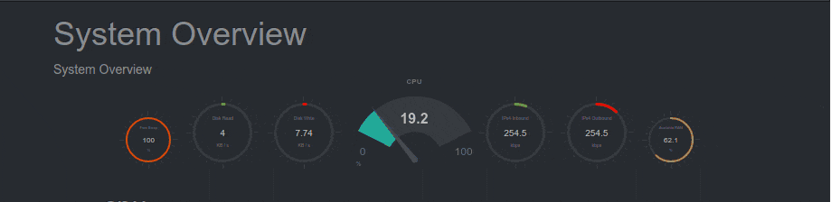
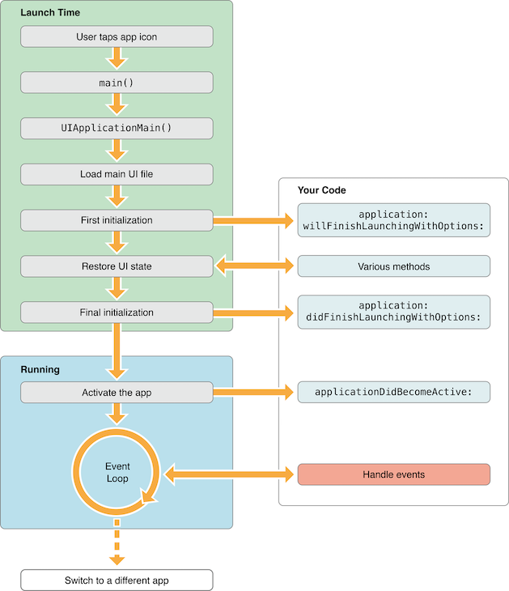
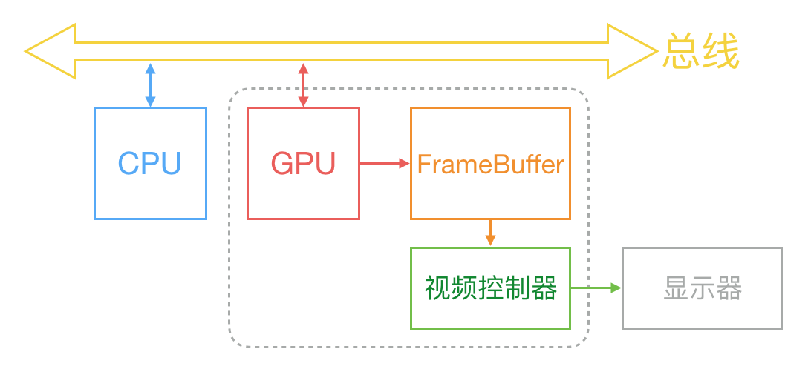
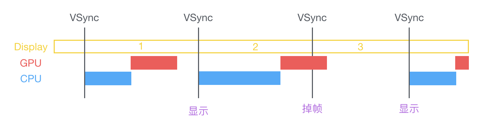
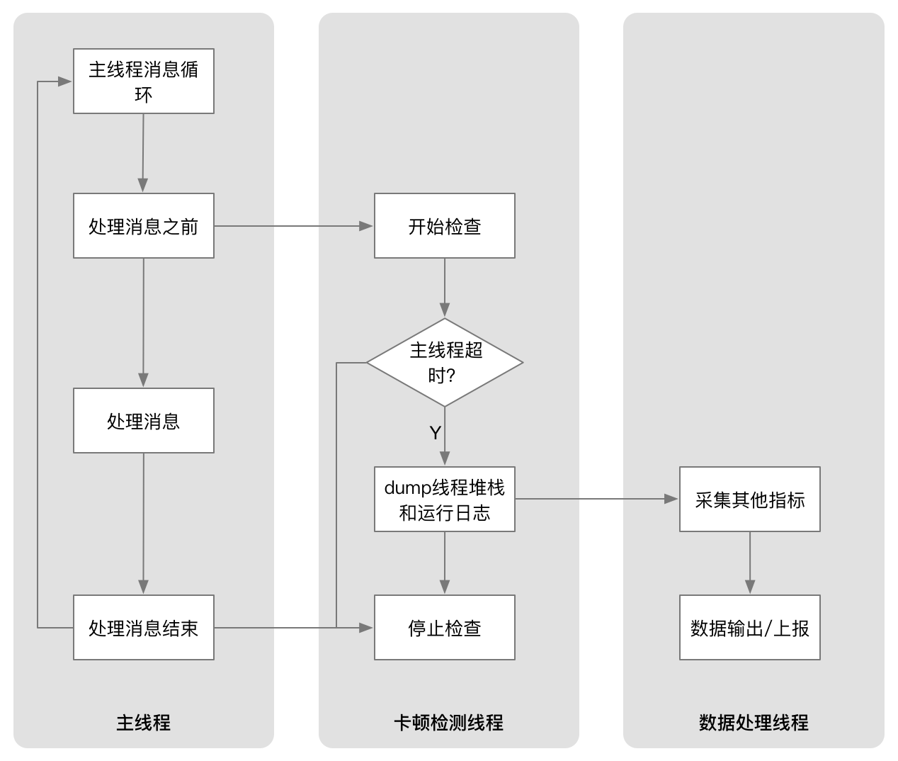
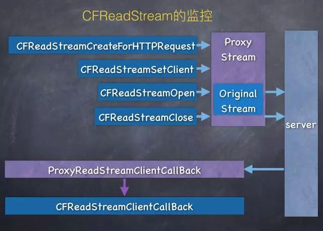
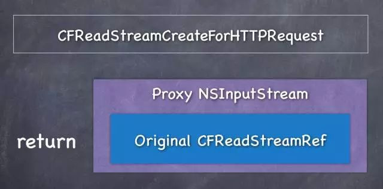
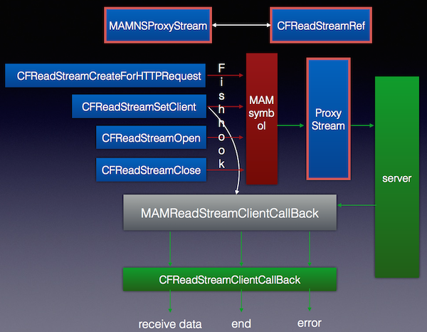

<p align="center">



</p>

## 为什么写这篇文章？

随着移动开发向纵深发展，用户越来越关心应用的体验，开发者必须关注应用性能所带来的用户流失问题。据统计，有十种应用性能问题危害最大，分别为：连接超时、闪退、卡顿、崩溃、黑白屏、网络劫持、交互性能差、CPU 使用率问题、内存泄露、不良接口。开发者难以兼顾所有的性能问题，而在传统的开发流程中，我们解决性能问题的方式通常是在得到线上用户的反馈后，再由开发人员去分析引发问题的根源；显然，凭借用户的反馈来得知应用的性能问题这种方式很原始，也很不高效，它使得开发团队在应对应用性能问题上很被动；所以寻找一种更专业和高效的手段来保障应用的性能就变得势在必行。性能监控 SDK 的定位就是帮助开发团队快速精确定位性能问题，进而推动应用的性能和用户体验的提升。

这篇文章是我在开发 iOS 性能监控平台 SDK 过程前期的调研和沉淀。主要会探讨下在 iOS 平台下如何采集性能指标，如 **CPU 占用率、内存使用情况、FPS、冷启动、热启动时间，流量，耗电量**等，剖析每一项指标的具体实现方式，SDK 的实现会有一定的技术难度，这也是我为什么写这篇文章的原因，我希望能够将开发过程中的一些心得和体会记录下来，同时后续我会将实现 SDK 的详细细节开源出来，希望能对读者有所帮助。

## CPU

获取当前应用的 **CPU** 占有率，注意方法最后要调用 `vm_deallocate`，防止出现内存泄漏，该方法采集的 **CPU** 数据和腾讯的 [GT](https://github.com/Tencent/GT)、**Instruments** 数据接近。

``` c
#import <mach/mach.h>
#import <assert.h>

float cpu_usage()
{
    kern_return_t kr;
    task_info_data_t tinfo;
    mach_msg_type_number_t task_info_count;

    task_info_count = TASK_INFO_MAX;
    kr = task_info(mach_task_self(), TASK_BASIC_INFO, (task_info_t)tinfo, &task_info_count);
    if (kr != KERN_SUCCESS) {
        return -1;
    }

    task_basic_info_t      basic_info;
    thread_array_t         thread_list;
    mach_msg_type_number_t thread_count;

    thread_info_data_t     thinfo;
    mach_msg_type_number_t thread_info_count;

    thread_basic_info_t basic_info_th;
    uint32_t stat_thread = 0; // Mach threads

    basic_info = (task_basic_info_t)tinfo;

    // get threads in the task
    kr = task_threads(mach_task_self(), &thread_list, &thread_count);
    if (kr != KERN_SUCCESS) {
        return -1;
    }
    if (thread_count > 0)
        stat_thread += thread_count;

    long tot_sec = 0;
    long tot_usec = 0;
    float tot_cpu = 0;
    int j;

    for (j = 0; j < (int)thread_count; j++)
    {
        thread_info_count = THREAD_INFO_MAX;
        kr = thread_info(thread_list[j], THREAD_BASIC_INFO,
                         (thread_info_t)thinfo, &thread_info_count);
        if (kr != KERN_SUCCESS) {
            return -1;
        }

        basic_info_th = (thread_basic_info_t)thinfo;

        if (!(basic_info_th->flags & TH_FLAGS_IDLE)) {
            tot_sec = tot_sec + basic_info_th->user_time.seconds + basic_info_th->system_time.seconds;
            tot_usec = tot_usec + basic_info_th->user_time.microseconds + basic_info_th->system_time.microseconds;
            tot_cpu = tot_cpu + basic_info_th->cpu_usage / (float)TH_USAGE_SCALE * 100.0;
        }

    } // for each thread

    kr = vm_deallocate(mach_task_self(), (vm_offset_t)thread_list, thread_count * sizeof(thread_t));
    assert(kr == KERN_SUCCESS);

    return tot_cpu;
}

```
[GT](https://github.com/Tencent/GT) 中获得 App 的 **CPU** 占有率的方法

``` objective-c
- (float)getCpuUsage
{
    kern_return_t           kr;
    thread_array_t          thread_list;
    mach_msg_type_number_t  thread_count;
    thread_info_data_t      thinfo;
    mach_msg_type_number_t  thread_info_count;
    thread_basic_info_t     basic_info_th;
    
    kr = task_threads(mach_task_self(), &thread_list, &thread_count);
    if (kr != KERN_SUCCESS) {
        return -1;
    }
    cpu_usage = 0;
    
    for (int i = 0; i < thread_count; i++)
    {
        thread_info_count = THREAD_INFO_MAX;
        kr = thread_info(thread_list[i], THREAD_BASIC_INFO,(thread_info_t)thinfo, &thread_info_count);
        if (kr != KERN_SUCCESS) {
            return -1;
        }
        
        basic_info_th = (thread_basic_info_t)thinfo;

        if (!(basic_info_th->flags & TH_FLAGS_IDLE))
        {
            cpu_usage += basic_info_th->cpu_usage;
        }
    }
    
    cpu_usage = cpu_usage / (float)TH_USAGE_SCALE * 100.0;
    
    vm_deallocate(mach_task_self(), (vm_offset_t)thread_list, thread_count * sizeof(thread_t));
    
    return cpu_usage;
}

```

## Memory

获取当前 **App Memory** 使用情况

``` objective-c
- (NSUInteger)getResidentMemory
{
    struct task_basic_info t_info;
	mach_msg_type_number_t t_info_count = TASK_BASIC_INFO_COUNT;
	
	int r = task_info(mach_task_self(), TASK_BASIC_INFO, (task_info_t)&t_info, &t_info_count);
	if (r == KERN_SUCCESS)
	{
		return t_info.resident_size;
	}
	else
	{
		return -1;
	}
}

```

获取当前设备的 **Memory** 使用情况

``` c
int64_t getUsedMemory()
{
    size_t length = 0;
    int mib[6] = {0};
    
    int pagesize = 0;
    mib[0] = CTL_HW;
    mib[1] = HW_PAGESIZE;
    length = sizeof(pagesize);
    if (sysctl(mib, 2, &pagesize, &length, NULL, 0) < 0)
    {
        return 0;
    }
    
    mach_msg_type_number_t count = HOST_VM_INFO_COUNT;
    
    vm_statistics_data_t vmstat;
    
    if (host_statistics(mach_host_self(), HOST_VM_INFO, (host_info_t)&vmstat, &count) != KERN_SUCCESS)
    {
		return 0;
    }
    
    int wireMem = vmstat.wire_count * pagesize;
	int activeMem = vmstat.active_count * pagesize;
    return wireMem + activeMem;
}

```

## Startup Time

毫无疑问移动应用的启动时间是影响用户体验的一个重要方面，那么我们究竟该如何通过启动时间来衡量一个应用性能的好坏呢？启动时间可以从冷启动和热启动两个角度去测量

* 冷启动：指的是应用尚未运行，必须加载并构建整个应用，完成初始化的工作，冷启动往往比热启动耗时长，而且每个应用的冷启动耗时差别也很大，所以冷启动存在很大的优化空间，冷启动时间从`applicationDidFinishLaunching:withOptions:`方法开始计算，很多应用会在该方法对其使用的第三方库初始化。
* 热启动：应用已经在后台运行(常见的场景是用户按了 Home 按钮)，由于某个事件将应用唤醒到前台，应用会在 `applicationWillEnterForeground:` 方法接收应用进入前台的事件

先来研究下冷启动，因为在它里面存在很多资源密集型的操作，下面先看看苹果官方文档给的应用的启动时序图

<p align="center">



</p>

t(App 总启动时间) = t1(`main()`之前的加载时间) + t2(`main()`之后的加载时间)。

t1 = 系统的 dylib (动态链接库)和 App 可执行文件的加载时间

t2 = `main`函数执行之后到 `AppDelegate` 类中的`applicationDidFinishLaunching:withOptions:`方法执行结束前这段时间

先来看看如何通过打点的方式统计`main`函数之后的时间，下面代码是有些文章给出的一种实现方式

``` objective-c
CFAbsoluteTime StartTime;

int main(int argc, char * argv[]) {
    @autoreleasepool {
        StartTime = CFAbsoluteTimeGetCurrent();
        return UIApplicationMain(argc, argv, nil, NSStringFromClass([AppDelegate class]));
    }
}

extern CFAbsoluteTime StartTime;
 ...
 
// 在 applicationDidFinishLaunching:withOptions: 方法的最后统计
dispatch_async(dispatch_get_main_queue(), ^{
    NSLog(@"Launched in %f sec", CFAbsoluteTimeGetCurrent() - StartTime);
});


```
> 上述代码使用`CFAbsoluteTimeGetCurrent()`方法来计算时间，`CFAbsoluteTimeGetCurrent()`的概念和`NSDate`非常相似，只不过参考点是以 GMT 为标准的，2001年一月一日00：00：00这一刻的时间绝对值。`CFAbsoluteTimeGetCurrent()`也会跟着当前设备的系统时间一起变化，也可能会被用户修改。他的精确度可能是微秒（μs）

其实还可以通过`mach_absolute_time()`来计算时间，这个一般很少用，他表示 CPU 的时钟周期数（ticks），精确度可以达到纳秒（ns），`mach_absolute_time()`不受系统时间影响，只受设备重启和休眠行为影响。示例代码如下

``` objective-c
static uint64_t loadTime;
static uint64_t applicationRespondedTime = -1;
static mach_timebase_info_data_t timebaseInfo;

static inline NSTimeInterval MachTimeToSeconds(uint64_t machTime) {
    return ((machTime / 1e9) * timebaseInfo.numer) / timebaseInfo.denom;
}

@implementation XXStartupMeasurer

+ (void)load {
    loadTime = mach_absolute_time();
    mach_timebase_info(&timebaseInfo);
    
    @autoreleasepool {
        __block id<NSObject> obs;
        obs = [[NSNotificationCenter defaultCenter] addObserverForName:UIApplicationDidFinishLaunchingNotification
                                                                object:nil queue:nil
                                                            usingBlock:^(NSNotification *note) {
            dispatch_async(dispatch_get_main_queue(), ^{
                applicationRespondedTime = mach_absolute_time();
                NSLog(@"StartupMeasurer: it took %f seconds until the app could respond to user interaction.", MachTimeToSeconds(applicationRespondedTime - loadTime));
            });
            [[NSNotificationCenter defaultCenter] removeObserver:obs];
        }];
    }
}

```

> 因为类的`+ load`方法在`main`函数执行之前调用，所以我们可以在`+ load`方法记录开始时间，同时监听`UIApplicationDidFinishLaunchingNotification`通知，收到通知时将时间相减作为应用启动时间，这样做有一个好处，不需要侵入到业务方的`main`函数去记录开始时间点。

## FPS

首先来看 **wikipedia** 上是怎么定义 FPS(Frames Per Second)。
> Frame rate (expressed in frames per second or FPS) is the frequency (rate) at which consecutive images called frames are displayed in an animated display. The term applies equally to film and video cameras, computer graphics, and motion capture systems. Frame rate may also be called the frame frequency, and be expressed in hertz.

通过定义可以看出 FPS 是测量用于保存、显示动态视频的信息数量，每秒钟帧数愈多，所显示的动作就会愈流畅，一般应用只要保持 FPS 在 50-60，应用就会给用户流畅的感觉，反之，用户则会感觉到卡顿。

接下来我们看下网络上流传的最多的关于测量 FPS 的方法，**GitHub** 上有关计算 FPS 的仓库基本都是通过以下方式实现的：

``` objective-c
@implementation YYFPSLabel {
    CADisplayLink *_link;
    NSUInteger _count;
    NSTimeInterval _lastTime;    
}

- (id)init {
    self = [super init];
    if( self ){        
    _link = [CADisplayLink displayLinkWithTarget:[YYWeakProxy proxyWithTarget:self] selector:@selector(tick:)];
    [_link addToRunLoop:[NSRunLoop mainRunLoop] forMode:NSRunLoopCommonModes];
        
    }
    return self;
}

- (void)dealloc {
    [_link invalidate];
}

- (void)tick:(CADisplayLink *)link {
    if (_lastTime == 0) {
        _lastTime = link.timestamp;
        return;
    }
    
    _count++;
    NSTimeInterval delta = link.timestamp - _lastTime;
    if (delta < 1) return;
    _lastTime = link.timestamp;
    float fps = _count / delta;
    _count = 0;    
}

```
> 上面是 `YYText` 中 Demo 的 `YYFPSLabel`，主要是基于`CADisplayLink`以屏幕刷新频率同步绘图的特性，尝试根据这点去实现一个可以观察屏幕当前帧数的指示器。`YYWeakProxy`的使用是为了避免循环引用。

值得注意的是基于`CADisplayLink`实现的 FPS 在生产场景中只有指导意义，不能代表真实的 FPS，因为基于`CADisplayLink`实现的 FPS 无法完全检测出当前 **Core Animation** 的性能情况，它只能检测出当前 **RunLoop** 的帧率。

## Freezing/Lag

### 为什么会出现卡顿

从一个像素到最后真正显示在屏幕上，iPhone 究竟在这个过程中做了些什么？想要了解背后的运作流程，首先需要了解屏幕显示的原理。iOS 上完成图形的显示实际上是 CPU、GPU 和显示器协同工作的结果，具体来说，CPU 负责计算显示内容，包括视图的创建、布局计算、图片解码、文本绘制等，CPU 完成计算后会将计算内容提交给 GPU，GPU 进行变换、合成、渲染后将渲染结果提交到帧缓冲区，当下一次垂直同步信号（简称 V-Sync）到来时，最后显示到屏幕上。下面是显示流程的示意图：

<p align="center">



</p>

上文中提到 V-Sync 是什么，以及为什么要在 iPhone 的显示流程引入它呢？在 iPhone 中使用的是双缓冲机制，即上图中的 FrameBuffer 有两个缓冲区，双缓冲区的引入是为了提升显示效率，但是与此同时，他引入了一个新的问题，当视频控制器还未读取完成时，比如屏幕内容刚显示一半时，GPU 将新的一帧内容提交到帧缓冲区并把两个缓冲区进行交换后，视频控制器就会把新的一帧数据的下半段显示到屏幕上，造成画面撕裂现象，V-Sync 就是为了解决画面撕裂问题，开启 V-Sync 后，GPU 会在显示器发出 V-Sync 信号后，去进行新帧的渲染和缓冲区的更新。

搞清楚了 iPhone 的屏幕显示原理后，下面来看看在 iPhone 上为什么会出现卡顿现象，上文已经提及在图像真正在屏幕显示之前，CPU 和 GPU 需要完成自身的任务，而如果他们完成的时间错过了下一次 V-Sync 的到来（通常是1000/60=16.67ms），这样就会出现显示屏还是之前帧的内容，这就是界面卡顿的原因。不难发现，无论是 CPU 还是 GPU 引起错过 V-Sync 信号，都会造成界面卡顿。

<p align="center">



</p>

### 如何监控卡顿

那怎么监控应用的卡顿情况？通常有以下两种方案

* FPS 监控：这是最容易想到的一种方案，如果帧率越高意味着界面越流畅，上文也给出了计算 FPS 的实现方式，通过一段连续的 FPS 计算丢帧率来衡量当前页面绘制的质量。
* 主线程卡顿监控：这是业内常用的一种检测卡顿的方法，通过开辟一个子线程来监控主线程的 **RunLoop**，当两个状态区域之间的耗时大于阈值时，就记为发生一次卡顿。美团的移动端性能监控方案 **Hertz** 采用的就是这种方式

FPS 的刷新频率非常快，并且容易发生抖动，因此直接通过比较 FPS 来侦测卡顿是比较困难的；此外，主线程卡顿监控也会发生抖动，所以微信读书团队给出一种综合方案，结合主线程监控、FPS 监控，以及 CPU 使用率等指标，作为判断卡顿的标准。**Bugly** 的卡顿检测也是基于这套标准。

当监控到应用出现卡顿，如何定位造成卡顿的原因呢？试想如果我们能够在发生卡顿的时候，保存应用的上下文，即卡顿发生时程序的堆栈调用和运行日志，那么就能凭借这些信息更加高效地定位到造成卡顿问题的来源。下图是 **Hertz** 监控卡顿的流程图

<p align="center">



</p>

主线程卡顿监控的实现思路：开辟一个子线程，然后实时计算 `kCFRunLoopBeforeSources` 和 `kCFRunLoopAfterWaiting` 两个状态区域之间的耗时是否超过某个阀值，来断定主线程的卡顿情况，可以将这个过程想象成操场上跑圈的运动员，我们会每隔一段时间间隔去判断是否跑了一圈，如果发现在指定时间间隔没有跑完一圈，则认为在消息处理的过程中耗时太多，视为主线程卡顿。

``` objective-c
static void runLoopObserverCallBack(CFRunLoopObserverRef observer, CFRunLoopActivity activity, void *info)
{
    MyClass *object = (__bridge MyClass*)info;
    
    // 记录状态值
    object->activity = activity;
    
    // 发送信号
    dispatch_semaphore_t semaphore = moniotr->semaphore;
    dispatch_semaphore_signal(semaphore);
}

- (void)registerObserver
{
    CFRunLoopObserverContext context = {0,(__bridge void*)self,NULL,NULL};
    CFRunLoopObserverRef observer = CFRunLoopObserverCreate(kCFAllocatorDefault,
                                                            kCFRunLoopAllActivities,
                                                            YES,
                                                            0,
                                                            &runLoopObserverCallBack,
                                                            &context);
    CFRunLoopAddObserver(CFRunLoopGetMain(), observer, kCFRunLoopCommonModes);
    
    // 创建信号
    semaphore = dispatch_semaphore_create(0);
    
    // 在子线程监控时长
    dispatch_async(dispatch_get_global_queue(0, 0), ^{
        while (YES)
        {
            // 假定连续5次超时50ms认为卡顿(当然也包含了单次超时250ms)
            long st = dispatch_semaphore_wait(semaphore, dispatch_time(DISPATCH_TIME_NOW, 50*NSEC_PER_MSEC));
            if (st != 0)
            {
                if (activity==kCFRunLoopBeforeSources || activity==kCFRunLoopAfterWaiting)
                {
                    if (++timeoutCount < 5)
                        continue;
                    // 检测到卡顿，进行卡顿上报
                }
            }
            timeoutCount = 0;
        }
    });
}

                                                          
```

> 代码中使用 `timeoutCount` 变量来覆盖多次连续的小卡顿，当累计次数超过5次，也会进入到卡顿逻辑。

当检测到了卡顿，下一步需要做的就是记录卡顿的现场，即此时程序的堆栈调用，可以借助开源库 **PLCrashReporter** 来实现，示例代码：

``` objective-c
PLCrashReporterConfig *config = [[PLCrashReporterConfig alloc] initWithSignalHandlerType:PLCrashReporterSignalHandlerTypeBSD
                                                                   symbolicationStrategy:PLCrashReporterSymbolicationStrategyAll];
PLCrashReporter *crashReporter = [[PLCrashReporter alloc] initWithConfiguration:config];
NSData *data = [crashReporter generateLiveReport];
PLCrashReport *reporter = [[PLCrashReport alloc] initWithData:data error:NULL];
NSString *report = [PLCrashReportTextFormatter stringValueForCrashReport:reporter
                                                          withTextFormat:PLCrashReportTextFormatiOS];                                                
```

## Traffic

流量监控一般通过 `NSURLProtocol` 和 `CFNetwork` 这两种方式来实现，由于 `NSURLProtocol` 作为上层接口，使用起来更为方便，因此大部分 SDK 都选择它来实现流量监控，但是 `NSURLProtocol` 属于 **URL Loading System** 体系中，应用层的协议支持有限，只支持 **FTP**，**HTTP**，**HTTPS** 等几个应用层协议，对于使用其他协议的流量则束手无策，所以存在一定的局限性。监控底层网络库 `CFNetwork` 则没有这个限制，有些人可能会问为什么不用更加底层的 **BSD Socket**，那样不是可以得到更多的控制吗？不使用 **BSD Socket** 理由是 **BSD Socket** 既不走系统中的 VPN 通道，也没相关的 API 来自动激活已经关闭掉的 Wi-Fi 或蜂窝无线设备，另外有人反应使用 **Fishhook** 没办法 hook **BSD Socket**，所以更倾向使用 `CFNetwork` 实现流量监控。

### NSURLProtocol

``` objective-c

//MyHttpProtocol.m

#import <Foundation/Foundation.h>
#import "MyHttpProtocol.h"

@implementation MyHttpProtocol

+(BOOL)canInitWithRequest:(NSURLRequest *)request {    
   NSString *scheme =[[request URL] scheme];
    if([[scheme lowercaseString] isEqualToString:@"http"]||
       [[scheme lowercaseString] isEqualToString:@"https"])
    {
        if([NSURLProtocol propertyForKey:@"processed" inRequest:request]){
            return NO;
        }
        return YES;
    }
    return NO;
}


+ (NSURLRequest *)canonicalRequestForRequest:(NSURLRequest *)request {
    NSMutableURLRequest * duplicatedRequest;
    duplicatedRequest =  [request mutableCopy];
    [NSURLProtocol setProperty:@YES forKey:@"processed" inRequest:duplicatedRequest];
    NSLog(@"%@",request.HTTPBody);
    return (NSURLRequest *) duplicatedRequest;
}

#pragma mark - NSURLConnectionDelegate

- (void)connection:(NSURLConnection *)connection
  didFailWithError:(NSError *)error {
    [[self client] URLProtocol:self didFailWithError:error];
}

- (BOOL)connectionShouldUseCredentialStorage:(NSURLConnection *)connection {
    return YES;
}

- (void)connection:(NSURLConnection *)connection
didReceiveAuthenticationChallenge:(NSURLAuthenticationChallenge *)challenge {
    [[self client] URLProtocol:self didReceiveAuthenticationChallenge:challenge];
}

- (void)connection:(NSURLConnection *)connection
didCancelAuthenticationChallenge:(NSURLAuthenticationChallenge *)challenge {
    [[self client] URLProtocol:self didCancelAuthenticationChallenge:challenge];
}

#pragma mark - NSURLConnectionDataDelegate
- (NSURLRequest *)connection:(NSURLConnection *)connection willSendRequest:(NSURLRequest *)request redirectResponse:(NSURLResponse *)response {
    if (response != nil){
        self.response = response;
        [[self client] URLProtocol:self wasRedirectedToRequest:request redirectResponse:response];
    }
    return request;
}

- (void)connection:(NSURLConnection *)connection
didReceiveResponse:(NSURLResponse *)response {
    [[self client] URLProtocol:self didReceiveResponse:response cacheStoragePolicy:NSURLCacheStorageAllowed];
    self.response = response;
}

- (void)connection:(NSURLConnection *)connection
    didReceiveData:(NSData *)data {
    NSString *mimeType = self.response.MIMEType;
    if ([mimeType isEqualToString:@"application/json"]) {
        NSArray *allMapRequests = [[NEHTTPModelManager defaultManager] allMapObjects];
        for (NSInteger i=0; i < allMapRequests.count; i++) {
            NEHTTPModel *req = [allMapRequests objectAtIndex:i];
            if ([[ne_HTTPModel.ne_request.URL absoluteString] containsString:req.mapPath]) {
                NSData *jsonData = [req.mapJSONData dataUsingEncoding:NSUTF8StringEncoding];
                [[self client] URLProtocol:self didLoadData:jsonData];
                [self.data appendData:jsonData];
                return;

            }
        }
    }
    [[self client] URLProtocol:self didLoadData:data];
    [self.data appendData:data];
}

- (NSCachedURLResponse *)connection:(NSURLConnection *)connection
                  willCacheResponse:(NSCachedURLResponse *)cachedResponse {
    return cachedResponse;
}

- (void)connectionDidFinishLoading:(NSURLConnection *)connection {
    [[self client] URLProtocolDidFinishLoading:self];
}

                                                          
```

> **Hertz** 使用的是 `NSURLProtocol` 这种方式，通过继承 `NSURLProtocol`，实现 `NSURLConnectionDelegate` 来实现截取行为。

**URL Loading System** 允许加载多个 `NSURLProtocol`，将他们存放在一个数组中，而 **AFNetworking** 只会使用这个数组中的第一个 `protocol`，可以通过 **Method Swizzling** 来解决这个问题，代码如下：

``` objective-c
#import <Foundation/Foundation.h>
#import "MySessionConfiguration.h"
#import "MyHttpProtocol.h"
#import <objc/runtime.h>

@implementation MySessionConfiguration

//默认的单例
+ (MySessionConfiguration *)defaultConfiguration {
    static MySessionConfiguration *staticConfiguration;
    static dispatch_once_t onceToken;
    dispatch_once(&onceToken, ^{
        staticConfiguration =[[MySessionConfiguration alloc] init];
    });
    return staticConfiguration;
}


- (instancetype)init {
    self = [super init];
    if(self){
        self.isSwizzle=NO;
    }
    return self;
}

//load被调用的时候，其实吧session.configuration.protocolClasses 这个数组从原有配置换成了只有MyHttpProtocol
- (void)load {
    NSLog(@"----configuration load --");
    self.isSwizzle=YES;
    Class cls = NSClassFromString(@"__NSCFURLSessionConfiguration") ?:NSClassFromString(@"NSURLSessionConfiguration");
    [self swizzleSelector:@selector(protocolClasses) fromClass:cls toClass:[self class]];

}

- (void)unload {
    self.isSwizzle=NO;
     Class cls = NSClassFromString(@"__NSCFURLSessionConfiguration") ?:NSClassFromString(@"NSURLSessionConfiguration");
     [self swizzleSelector:@selector(protocolClasses) fromClass:cls toClass:[self class]];
}

- (void)swizzleSelector:(SEL)selector fromClass:(Class)original toClass:(Class)stub {
    Method originalMethod = class_getInstanceMethod(original, selector);
    Method stubMethod = class_getInstanceMethod(stub, selector);
    if(!originalMethod || !stubMethod){
        [NSException raise:NSInternalInconsistencyException format:@"Could't load NSURLSessionConfiguration "];
    }

   //真正的替换在这里
    method_exchangeImplementations(originalMethod, stubMethod);
}

 //返回MyHttpProtocol
- (NSArray *)protocolClasses {
    return @[[MyHttpProtocol class]];
}

@end                                               
```

然后在应用启动时候加载

``` objective-c
- (BOOL)application:(UIApplication *)application didFinishLaunchingWithOptions:(NSDictionary *)launchOptions {

   [[[MySessionConfiguration alloc] init] load];

    return YES;
}                                                     
```

### CFNetwork

#### 概述

以 **NeteaseAPM** 作为案例来讲解如何通过 `CFNetwork` 实现网络监控，它是通过使用代理模式来实现的，在 `CoreFoundation` Framework 的 `CFStream` 实现一个 Proxy Stream 从而达到拦截的目的，记录通过 `CFStream` 读取的网络数据长度，然后再转发给 Original Stream，流程图如下：

<p align="center">



</p>

#### 详细描述

由于 `CFNetwork` 都是 **C** 函数实现，想要对 **C** 函数 进行 Hook 需要使用 **Dynamic Loader Hook** 库函数 - [fishhook](https://github.com/facebook/fishhook)，

> **Dynamic Loader**（dyld）通过更新 **Mach-O** 文件中保存的指针的方法来绑定符号。借用它可以在 **Runtime** 修改 **C** 函数调用的函数指针。**fishhook** 的实现原理：遍历 `__DATA segment` 里面 `__nl_symbol_ptr` 、`__la_symbol_ptr` 两个 section 里面的符号，通过 Indirect Symbol Table、Symbol Table 和 String Table 的配合，找到自己要替换的函数，达到 hook 的目的。

`CFNetwork` 使用 `CFReadStreamRef` 做数据传递，使用回调函数来接收服务器响应。当回调函数收到流中有数据的通知后，将数据保存到客户端的内存中。显然对流的读取不适合使用修改字符串表的方式，如果这样做的话也会 hook 系统也在使用的 `read` 函数，而系统的 `read` 函数不仅仅被网络请求的 stream 调用，还有所有的文件处理，而且 hook 频繁调用的函数也是不可取的。

使用上述方式的缺点就是无法做到选择性的监控和 **HTTP** 相关的 `CFReadStream`，而不涉及来自文件和内存的 `CFReadStream`，**NeteaseAPM** 的解决方案是在系统构造 HTTP Stream 时，将一个 `NSInputStream` 的子类 `ProxyStream` 桥接为 `CFReadStream` 返回给用户，来达到单独监控 **HTTP Stream** 的目的。

<p align="center">



</p>

具体的实现思路就是：首先设计一个继承自 `NSObject` 并持有 `NSInputStream` 对象的 **Proxy** 类，持有的 `NSInputStream` 记为 OriginalStream。将所有发向 Proxy 的消息转发给 OriginalStream 处理，然后再重写 `NSInputStream` 的 `read:maxLength:` 方法，如此一来，我们就可以获取到 stream 的大小了。
`XXInputStreamProxy` 类的代码如下：

``` objective-c
- (instancetype)initWithStream:(id)stream {
    if (self = [super init]) {
        _stream = stream;
    }
    return self;
}

- (NSMethodSignature *)methodSignatureForSelector:(SEL)aSelector {
    return [_stream methodSignatureForSelector:aSelector];
}

- (void)forwardInvocation:(NSInvocation *)anInvocation {
    [anInvocation invokeWithTarget:_stream];
}
                                                        
```

继承 `NSInputStream` 并重写 `read:maxLength:` 方法：

``` objective-c
- (NSInteger)read:(uint8_t *)buffer maxLength:(NSUInteger)len {
    NSInteger readSize = [_stream read:buffer maxLength:len];
    // 记录 readSize
    return readSize;
}                                                   
```

`XX_CFReadStreamCreateForHTTPRequest` 会被用来替换系统的 `CFReadStreamCreateForHTTPRequest` 方法

``` objective-c

static CFReadStreamRef (*original_CFReadStreamCreateForHTTPRequest)(CFAllocatorRef __nullable alloc,
                                                                    CFHTTPMessageRef request);
                         
/**
 XXInputStreamProxy 持有 original CFReadStreamRef，转发消息到 original CFReadStreamRef，
 在 read 方法中记录获取数据的大小
 */
static CFReadStreamRef XX_CFReadStreamCreateForHTTPRequest(CFAllocatorRef alloc,
                                                           CFHTTPMessageRef request) {
    // 使用系统方法的函数指针完成系统的实现
    CFReadStreamRef originalCFStream = original_CFReadStreamCreateForHTTPRequest(alloc, request);
    // 将 CFReadStreamRef 转换成 NSInputStream，并保存在 XXInputStreamProxy，最后返回的时候再转回 CFReadStreamRef
    NSInputStream *stream = (__bridge NSInputStream *)originalCFStream;
    XXInputStreamProxy *outStream = [[XXInputStreamProxy alloc] initWithClient:stream];
    CFRelease(originalCFStream);
    CFReadStreamRef result = (__bridge_retained CFReadStreamRef)outStream;
    return result;
}                                                             
                                                        
```
使用 **fishhook** 替换函数地址

``` objective-c
void save_original_symbols() {
    original_CFReadStreamCreateForHTTPRequest = dlsym(RTLD_DEFAULT, "CFReadStreamCreateForHTTPRequest");
}                                                      
```

``` objective-c
rebind_symbols((struct rebinding[1]){{"CFReadStreamCreateForHTTPRequest", XX_CFReadStreamCreateForHTTPRequest, (void *)& original_CFReadStreamCreateForHTTPRequest}}, 1);                                                    
```


根据 `CFNetwork` API 的调用方式，使用 **fishhook** 和 Proxy Stream 获取 **C** 函数的设计模型如下：

<p align="center">



</p>


## Power consumption

iOS 设备的电量一直是用户非常关心的问题。如果你的应用由于某些缺陷不幸成为电量杀手，用户会毫不犹豫的卸载你的应用，所以耗电也是 App 性能的重要衡量标准之一。 

电量获取三种方案对比如下：

|方案|优点|缺点|
|:---:|:----:|:----:|
|UIDevice 属性|API 简单，易于使用|粗粒度，不符合需求|
|IOKit|可以设备当前的电流和电压|粒度较粗，无法到应用级别|
|越狱|可以获取应用每小时耗电量|时间间隔太长，不符合需求|

### UIDevice

`UIDevice` 提供了获取设备电池的相关信息，包括当前电池的状态以及电量。获取电池信息之前需要先将 `batteryMonitoringEnabled` 属性设置为 `YES`，然后就可以通过 `batteryState` 和 `batteryLevel` 获取电池信息。

* 是否开启电池监控，默认为 `NO`

``` objective-c
// default is NO             
@property(nonatomic,getter=isBatteryMonitoringEnabled) BOOL batteryMonitoringEnabled NS_AVAILABLE_IOS(3_0) __TVOS_PROHIBITED;                
```

* 电池电量，取值 0-1.0，如果 `batteryState` 是 `UIDeviceBatteryStateUnknown`，则电量是 -1.0

``` objective-c
// 0 .. 1.0. -1.0 if UIDeviceBatteryStateUnknown
@property(nonatomic,readonly) float batteryLevel NS_AVAILABLE_IOS(3_0) __TVOS_PROHIBITED; 
```

* 电池状态，为 `UIDeviceBatteryState` 枚举类型，总共有四种状态

``` objective-c
// UIDeviceBatteryStateUnknown if monitoring disabled
@property(nonatomic,readonly) UIDeviceBatteryState batteryState NS_AVAILABLE_IOS(3_0) __TVOS_PROHIBITED;  

typedef NS_ENUM(NSInteger, UIDeviceBatteryState) {
    UIDeviceBatteryStateUnknown,
    UIDeviceBatteryStateUnplugged,   // on battery, discharging
    UIDeviceBatteryStateCharging,    // plugged in, less than 100%
    UIDeviceBatteryStateFull,        // plugged in, at 100%
} __TVOS_PROHIBITED;              // available in iPhone 3.0
```

获取电量代码

``` objective-c
  [UIDevice currentDevice].batteryMonitoringEnabled = YES;
  [[NSNotificationCenter defaultCenter]
 addObserverForName:UIDeviceBatteryLevelDidChangeNotification
 object:nil queue:[NSOperationQueue mainQueue]
 usingBlock:^(NSNotification *notification) {
     // Level has changed
     NSLog(@"Battery Level Change");
     NSLog(@"电池电量：%.2f", [UIDevice currentDevice].batteryLevel);
 }];
                             
```

> 使用 `UIDevice` 可以非常方便获取到电量，经测试发现，在 iOS 8.0 之前，`batteryLevel` 只能精确到5%，而在 `iOS` 8.0 之后，精确度可以达到1%，但这种方案获取到的数据不是很精确，没办法应用到生产环境。

### IOKit

`IOKit` 是 iOS 系统的一个私有框架，它可以被用来获取硬件和设备的详细信息，也是与硬件和内核服务通信的底层框架。通过它可以获取设备电量信息，精确度达到1%。

``` objective-c
- (double)getBatteryLevel {
    // returns a blob of power source information in an opaque CFTypeRef
    CFTypeRef blob = IOPSCopyPowerSourcesInfo();
    // returns a CFArray of power source handles, each of type CFTypeRef
    CFArrayRef sources = IOPSCopyPowerSourcesList(blob);
    CFDictionaryRef pSource = NULL;
    const void *psValue;
    // returns the number of values currently in an array
    int numOfSources = CFArrayGetCount(sources);
    // error in CFArrayGetCount
    if (numOfSources == 0) {
        NSLog(@"Error in CFArrayGetCount");
        return -1.0f;
    }

    // calculating the remaining energy
    for (int i=0; i<numOfSources; i++) {
        // returns a CFDictionary with readable information about the specific power source
        pSource = IOPSGetPowerSourceDescription(blob, CFArrayGetValueAtIndex(sources, i));
        if (!pSource) {
            NSLog(@"Error in IOPSGetPowerSourceDescription");
            return -1.0f;
        }
        psValue = (CFStringRef) CFDictionaryGetValue(pSource, CFSTR(kIOPSNameKey));

        int curCapacity = 0;
        int maxCapacity = 0;
        double percentage;

        psValue = CFDictionaryGetValue(pSource, CFSTR(kIOPSCurrentCapacityKey));
        CFNumberGetValue((CFNumberRef)psValue, kCFNumberSInt32Type, &curCapacity);

        psValue = CFDictionaryGetValue(pSource, CFSTR(kIOPSMaxCapacityKey));
        CFNumberGetValue((CFNumberRef)psValue, kCFNumberSInt32Type, &maxCapacity);

        percentage = ((double) curCapacity / (double) maxCapacity * 100.0f);
        NSLog(@"curCapacity : %d / maxCapacity: %d , percentage: %.1f ", curCapacity, maxCapacity, percentage);
        return percentage;
    }
    return -1.0f;
}                                        
```

### 越狱方案

这种方案需要链接 `iOSDiagnosticsSupport` 私有库，然后通过 **Runtime** 拿到 `MBSDevice` 实例，调用 `copyPowerLogsToDir:` 方法将电量日志信息表（`PLBLMAccountingService_Aggregate_BLMAppEnergyBreakdown`）拷贝到硬盘的指定路径，日志信息表中包含了 iOS 系统采集的小时级别的耗电量。具体实现方案可以参考 [iOS-Diagnostics](https://github.com/lyonanderson/iOS-Diagnostics)。

从电量日志表中查询的 SQL 语句如下：

``` SQL
SELECT datetime(timestamp, 'unixepoch') AS TIME, BLMAppName FROM PLBLMAccountingService_Aggregate_BLMAppEnergyBreakdown WHERE BLMEnergy_BackgroundLocation > 0  ORDER BY TIME
```       

> 发现 `iOSDiagnosticsSupport` Framework 在 iOS 10 之后名字已经被改成 `DiagnosticsSupport`，而且 `MBSDevice` 类也被隐藏了。

## Author

Twitter: [@aozhimin](https://twitter.com/aozhimin0811)

Email: aozhimin0811@gmail.com

## 参考资料

* [iOS-System-Services](https://github.com/Shmoopi/iOS-System-Services)
* [GT](https://github.com/Tencent/GT)
* [Optimizing Facebook for iOS start time](https://code.facebook.com/posts/1675399786008080/optimizing-facebook-for-ios-start-time/)
* [Apple 文档：Strategies for Handling App State Transitions](https://developer.apple.com/library/content/documentation/iPhone/Conceptual/iPhoneOSProgrammingGuide/StrategiesforHandlingAppStateTransitions/StrategiesforHandlingAppStateTransitions.html)
* [iOS关于时间的处理](http://mrpeak.cn/blog/ios-time/)
* [StartupMeasurer](https://github.com/fealebenpae/StartupMeasurer)
* [Frame rate](https://en.wikipedia.org/wiki/Frame_rate)
* [YYText](https://github.com/ibireme/YYText)
* [移动端性能监控方案 Hertz](http://tech.meituan.com/hertz.html)
* [iOS 保持界面流畅的技巧](http://blog.ibireme.com/2015/11/12/smooth_user_interfaces_for_ios/)
* [微信读书 iOS 性能优化总结](https://wereadteam.github.io/2016/05/03/WeRead-Performance/)
* [PLCrashReporter](https://www.plcrashreporter.org/)
* [NetworkEye](https://github.com/coderyi/NetworkEye)
* [netfox](https://github.com/kasketis/netfox)
* [网易 NeteaseAPM iOS SDK 技术实现分享](http://www.infoq.com/cn/articles/netease-ios-sdk-neteaseapm-technology-share)
* [Mobile Application Monitor IOS组件设计技术分享](http://bbs.netease.im/read-tid-149)
* [iOS-Diagnostics](https://github.com/lyonanderson/iOS-Diagnostics)

