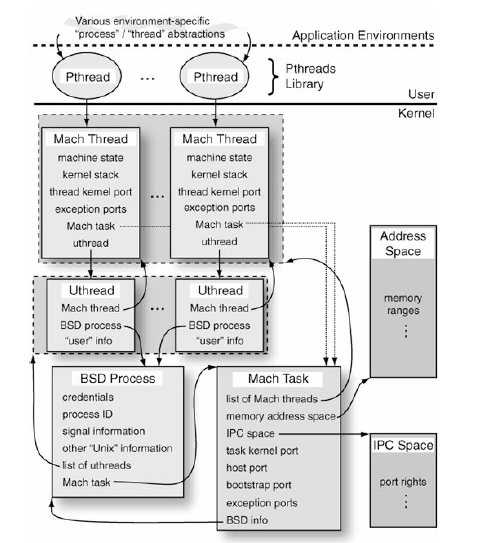
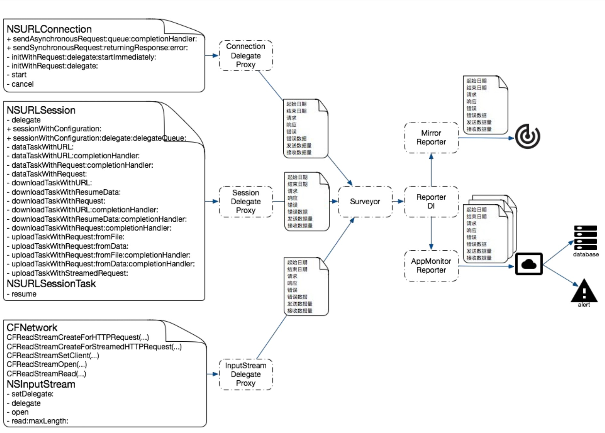
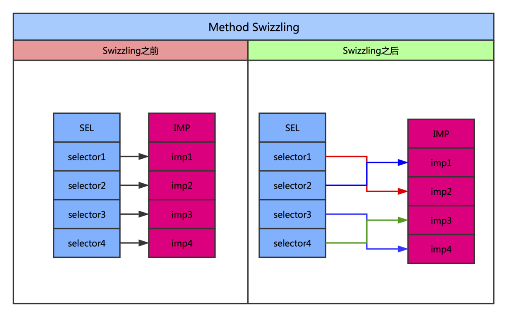
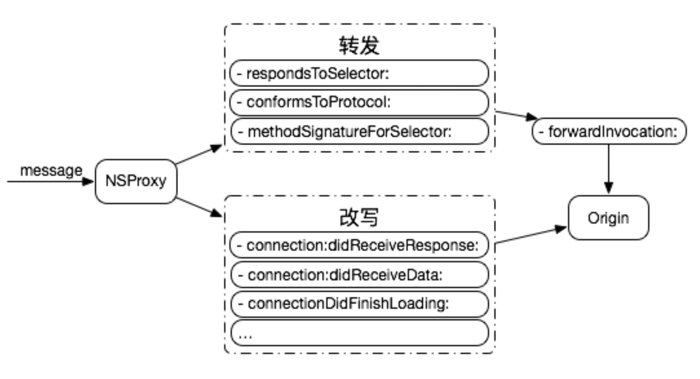
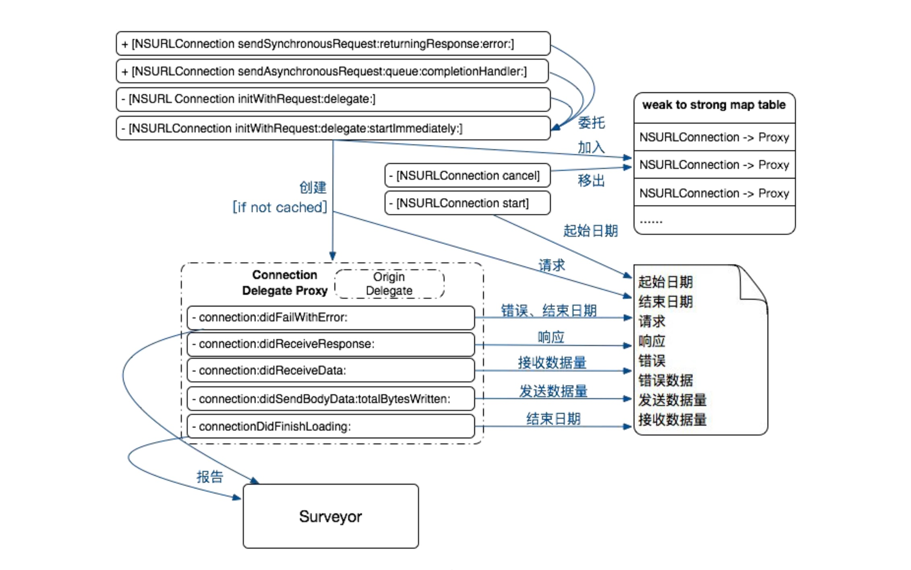
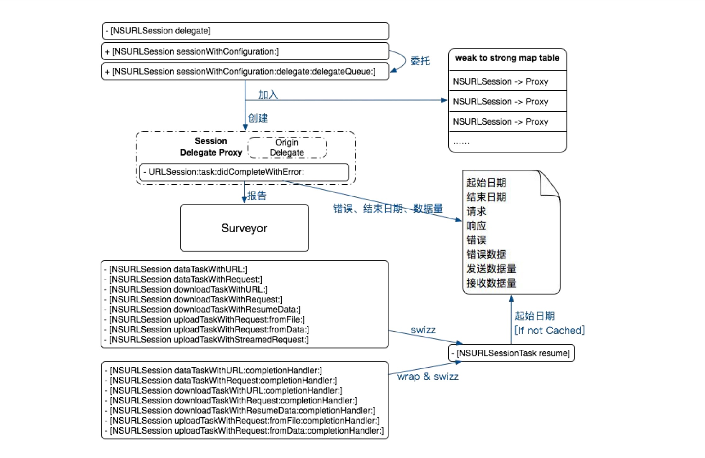
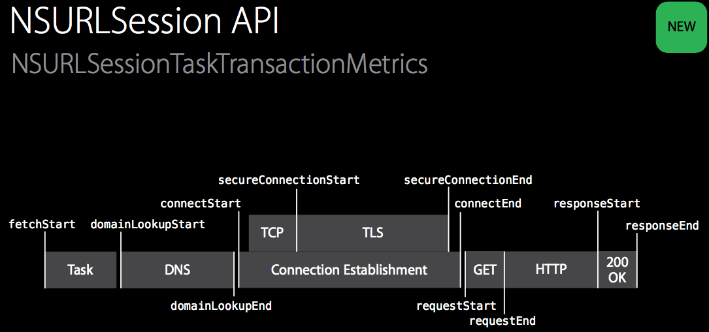

<p align="center">


</p>

为了让这篇文章能够在公众号发表，所以将文章拆解成上下两篇：基础性能篇和网络篇

*  [iOS 性能监控方案 Wedjat 之基础性能篇](iOS-Monitor-Platform_Basic.md)
*  [iOS 性能监控方案 Wedjat 之网络篇](iOS-Monitor-Platform_Network.md)


## 为什么写这篇文章？

随着移动互联网向纵深发展，用户变得越来越关心应用的体验，开发者必须关注应用性能所带来的用户流失问题。据统计，有十种应用性能问题危害最大，分别为：连接超时、闪退、卡顿、崩溃、黑白屏、网络劫持、交互性能差、CPU 使用率问题、内存泄露、不良接口。开发者难以兼顾所有的性能问题，而在传统的开发流程中，我们解决性能问题的方式通常是在得到线上用户的反馈后，再由开发人员去分析引发问题的根源；显然，凭借用户的反馈来得知应用的性能问题这种方式很原始，也很不高效，它使得开发团队在应对应用性能问题上很被动；所以寻找一种更专业和高效的手段来保障应用的性能就变得势在必行。性能监控 SDK 的定位就是帮助开发团队快速精确地定位性能问题，进而推动应用的性能和用户体验的提升。

这篇文章是我在开发 iOS 性能监控平台 SDK 过程前期的调研和沉淀。主要会探讨在 iOS 平台下如何采集性能指标，如 **CPU 占用率、内存使用情况、FPS、冷启动、热启动时间，网络，耗电量**等，剖析每一项性能指标的具体实现方式，SDK 的实现会有一定的技术难度，这也是我为什么写这篇文章的原因，我希望能够将开发过程中的一些心得和体会记录下来，同时后续我会将实现 SDK 的详细细节开源出来，希望能对读者有所帮助。

## 项目名称的来源

我们团队将这个项目命名为 **Wedjat（华狄特）**，取自古埃及神话中鹰头神荷鲁斯的眼睛，荷鲁斯是古埃及神话中法老的守护神，他通常被描绘成“隼头人身”的形象，最常见的代表符号是一只眼睛，该眼也被称之为“荷鲁斯之眼”，象征着“正义之眼”，严厉、公正、铁面无私，一切公开或私人的行为，都逃不过他的法眼。他不但是光明和天堂的象征，最早还是一位生育万物的大神，每天在尼罗河上巡视他的子民。**Wedjat** 的寓意恰好与我们性能监控 SDK 的愿景相契合。

> 荷鲁斯之眼又称真知之眼、埃及乌加眼，是一个自古埃及时代便流传至今的符号，也是古埃及文化中最令外人印象深刻的符号之一。荷鲁斯之眼顾名思义，它是鹰头神荷鲁斯的眼睛。荷鲁斯的右眼象征完整无缺的太阳，依据传说，因荷鲁斯战胜赛特，右眼有着远离痛苦，战胜邪恶的力量，荷鲁斯的左眼象征有缺损的月亮，依据传说，荷鲁斯后来将左眼献给欧西里斯，因而左眼亦有分辨善恶、捍卫健康与幸福的作用，亦使古埃及人也相信荷鲁斯的左眼具有复活死者的力量。

## CPU

> A CPU chip is designed for portable computers, it is typically housed in a smaller chip package, but more importantly, in order to run cooler, it uses lower voltages than its desktop counterpart and has more "sleep mode" capability. A mobile processor can be throttled down to different power levels or sections of the chip can be turned off entirely when not in use. Further, the clock frequency may be stepped down under low processor loads. This stepping down conserves power and prolongs battery life.

**CPU** 是移动设备最重要的计算资源，设计糟糕的应用可能会造成 **CPU** 持续以高负载运行，一方面会导致用户使用过程遭遇卡顿；另一方面也会导致手机发热发烫，电量被快速消耗完，严重影响用户体验。

如果想避免出现上述情况，可以通过监控应用的 **CPU** 占用率，那么在 iOS 中如何实现 **CPU** 占用率的监控呢？事实上，学习过操作系统课程的读者都了解线程是调度和分配的基本单位，而应用作为进程运行时，包含了多个不同的线程，显然如果我们能获取应用的所有线程占用 **CPU** 的情况，也就能知道应用的 **CPU** 占用率。

> iOS 是基于 Apple Darwin 内核，由 kernel、XNU 和 Runtime 组成，而 XNU 是 Darwin 的内核，它是“X is not UNIX”的缩写，是一个混合内核，由 Mach 微内核和 BSD 组成。Mach 内核是轻量级的平台，只能完成操作系统最基本的职责，比如：进程和线程、虚拟内存管理、任务调度、进程通信和消息传递机制。其他的工作，例如文件操作和设备访问，都由 BSD 层实现。

<p align="center">



</p>

上图是权威著作《OS X Internal: A System Approach》给出的 Mac OS X 中进程子系统组成的概念图，与 Mac OS X 类似，iOS 的线程技术也是基于 **Mach** 线程技术实现的，在 **Mach** 层中 `thread_basic_info` 结构体提供了线程的基本信息。

``` c
struct thread_basic_info {
        time_value_t    user_time;      /* user run time */
        time_value_t    system_time;    /* system run time */
        integer_t       cpu_usage;      /* scaled cpu usage percentage */
        policy_t        policy;         /* scheduling policy in effect */
        integer_t       run_state;      /* run state (see below) */
        integer_t       flags;          /* various flags (see below) */
        integer_t       suspend_count;  /* suspend count for thread */
        integer_t       sleep_time;     /* number of seconds that thread
                                           has been sleeping */
};
```

> 任务（task）是一种容器（container）对象，虚拟内存空间和其他资源都是通过这个容器对象管理的，这些资源包括设备和其他句柄。严格地说，**Mach** 的任务并不是其他操作系统中所谓的进程，因为 **Mach** 作为一个微内核的操作系统，并没有提供“进程”的逻辑，而只是提供了最基本的实现。不过在 BSD 的模型中，这两个概念有1：1的简单映射，每一个 BSD 进程（也就是 OS X 进程）都在底层关联了一个 Mach 任务对象。

上面引用的是《OS X and iOS Kernel Programming》对 Mach task 的描述，Mach task 可以看作一个机器无关的 thread 执行环境的抽象
一个 task 包含它的线程列表。内核提供了 `task_threads` API 调用获取指定 task 的线程列表，然后可以通过 `thread_info ` API 调用来查询指定线程的信息，`thread_info ` API 在 `thread_act.h` 中定义。

``` c
kern_return_t task_threads
(
	task_t target_task,
	thread_act_array_t *act_list,
	mach_msg_type_number_t *act_listCnt
);
```

`task_threads` 将 `target_task` 任务中的所有线程保存在 `act_list` 数组中，数组中包含 `act_listCnt` 个条目。

``` c
kern_return_t thread_info
(
	thread_act_t target_act,
	thread_flavor_t flavor,
	thread_info_t thread_info_out,
	mach_msg_type_number_t *thread_info_outCnt
);
```
`thread_info` 查询 `flavor` 指定的 thread 信息，将信息返回到长度为 `thread_info_outCnt` 字节的 `thread_info_out` 缓存区中，

有了上面的铺垫后，得到获取当前应用的 **CPU** 占用率的实现如下：

``` c
#import <mach/mach.h>
#import <assert.h>

float cpu_usage()
{
    kern_return_t kr;
    task_info_data_t tinfo;
    mach_msg_type_number_t task_info_count;

    task_info_count = TASK_INFO_MAX;
    kr = task_info(mach_task_self(), TASK_BASIC_INFO, (task_info_t)tinfo, &task_info_count);
    if (kr != KERN_SUCCESS) {
        return -1;
    }

    task_basic_info_t      basic_info;
    thread_array_t         thread_list;
    mach_msg_type_number_t thread_count;

    thread_info_data_t     thinfo;
    mach_msg_type_number_t thread_info_count;

    thread_basic_info_t basic_info_th;
    uint32_t stat_thread = 0; // Mach threads

    basic_info = (task_basic_info_t)tinfo;

    // get threads in the task
    kr = task_threads(mach_task_self(), &thread_list, &thread_count);
    if (kr != KERN_SUCCESS) {
        return -1;
    }
    if (thread_count > 0)
        stat_thread += thread_count;

    long tot_sec = 0;
    long tot_usec = 0;
    float tot_cpu = 0;
    int j;

    for (j = 0; j < (int)thread_count; j++)
    {
        thread_info_count = THREAD_INFO_MAX;
        kr = thread_info(thread_list[j], THREAD_BASIC_INFO,
                         (thread_info_t)thinfo, &thread_info_count);
        if (kr != KERN_SUCCESS) {
            return -1;
        }

        basic_info_th = (thread_basic_info_t)thinfo;

        if (!(basic_info_th->flags & TH_FLAGS_IDLE)) {
            tot_sec = tot_sec + basic_info_th->user_time.seconds + basic_info_th->system_time.seconds;
            tot_usec = tot_usec + basic_info_th->user_time.microseconds + basic_info_th->system_time.microseconds;
            tot_cpu = tot_cpu + basic_info_th->cpu_usage / (float)TH_USAGE_SCALE * 100.0;
        }

    } // for each thread

    kr = vm_deallocate(mach_task_self(), (vm_offset_t)thread_list, thread_count * sizeof(thread_t));
    assert(kr == KERN_SUCCESS);

    return tot_cpu;
}
```

在调用 `task_threads` API 时，`target_task ` 参数传入的是 `mach_task_self()`，表示获取当前的 Mach task。而在调用 `thread_info` API 时，`flavor` 参数传的是 `THREAD_BASIC_INFO `，使用这个类型会返回线程的基本信息，定义在 `thread_basic_info_t` 结构体，包含了用户和系统的运行时间，运行状态和调度优先级。

注意方法最后要调用 `vm_deallocate`，防止出现内存泄漏。据测试，该方法采集的 **CPU** 数据和腾讯的 [GT](https://github.com/Tencent/GT)、**Instruments** 数据接近。

> 由于监控 **CPU** 的线程也会占用 **CPU** 资源，所以为了让结果更客观，可以考虑在计算的时候将监控线程排除。

下面是 [GT](https://github.com/Tencent/GT) 中获得 App 的 **CPU** 占用率的方法

``` objective-c
- (float)getCpuUsage
{
    kern_return_t           kr;
    thread_array_t          thread_list;
    mach_msg_type_number_t  thread_count;
    thread_info_data_t      thinfo;
    mach_msg_type_number_t  thread_info_count;
    thread_basic_info_t     basic_info_th;
    
    kr = task_threads(mach_task_self(), &thread_list, &thread_count);
    if (kr != KERN_SUCCESS) {
        return -1;
    }
    cpu_usage = 0;
    
    for (int i = 0; i < thread_count; i++)
    {
        thread_info_count = THREAD_INFO_MAX;
        kr = thread_info(thread_list[i], THREAD_BASIC_INFO,(thread_info_t)thinfo, &thread_info_count);
        if (kr != KERN_SUCCESS) {
            return -1;
        }
        
        basic_info_th = (thread_basic_info_t)thinfo;

        if (!(basic_info_th->flags & TH_FLAGS_IDLE))
        {
            cpu_usage += basic_info_th->cpu_usage;
        }
    }
    
    cpu_usage = cpu_usage / (float)TH_USAGE_SCALE * 100.0;
    
    vm_deallocate(mach_task_self(), (vm_offset_t)thread_list, thread_count * sizeof(thread_t));
    
    return cpu_usage;
}
```

## Memory

> 物理内存（**RAM**）与 **CPU** 一样都是系统中最稀少的资源，也是最有可能产生竞争的资源，应用内存与性能直接相关 - 通常是以牺牲别的应用为代价。 不像 PC 端，iOS 没有交换空间作为备选资源，这就使得内存资源尤为重要。事实上，在 iOS 中就有 **Jetsam** 机制负责处理系统低 **RAM** 事件，**Jetsam** 是一种类似 Linux 的 Out-Of-Memory(Killer) 的机制。

`mach_task_basic_info` 结构体存储了 Mach task 的内存使用信息，其中 `resident_size` 就是应用使用的物理内存大小，`virtual_size` 是虚拟内存大小。

``` c
#define MACH_TASK_BASIC_INFO     20         /* always 64-bit basic info */
struct mach_task_basic_info {
        mach_vm_size_t  virtual_size;       /* virtual memory size (bytes) */
        mach_vm_size_t  resident_size;      /* resident memory size (bytes) */
        mach_vm_size_t  resident_size_max;  /* maximum resident memory size (bytes) */
        time_value_t    user_time;          /* total user run time for
                                               terminated threads */
        time_value_t    system_time;        /* total system run time for
                                               terminated threads */
        policy_t        policy;             /* default policy for new threads */
        integer_t       suspend_count;      /* suspend count for task */
};
```

这里需要提到的是有些文章使用的 `task_basic_info` 结构体，而不是上文的 `mach_task_basic_info`，值得注意的是 Apple 已经不建议再使用 `task_basic_info` 结构体了。

``` c
/* localized structure - cannot be safely passed between tasks of differing sizes */
/* Don't use this, use MACH_TASK_BASIC_INFO instead */
struct task_basic_info {
        integer_t       suspend_count;  /* suspend count for task */
        vm_size_t       virtual_size;   /* virtual memory size (bytes) */
        vm_size_t       resident_size;  /* resident memory size (bytes) */
        time_value_t    user_time;      /* total user run time for
                                           terminated threads */
        time_value_t    system_time;    /* total system run time for
                                           terminated threads */
	policy_t	policy;		/* default policy for new threads */
};
```

`task_info` API 根据指定的 `flavor` 类型返回 `target_task` 的信息。

``` c
kern_return_t task_info
(
	task_name_t target_task,
	task_flavor_t flavor,
	task_info_t task_info_out,
	mach_msg_type_number_t *task_info_outCnt
);
```

最后得到获取当前 **App Memory** 的使用情况

``` objective-c
- (NSUInteger)getResidentMemory
{
    struct mach_task_basic_info info;
    mach_msg_type_number_t count = MACH_TASK_BASIC_INFO_COUNT;
	
	int r = task_info(mach_task_self(), MACH_TASK_BASIC_INFO, (task_info_t)& info, & count);
	if (r == KERN_SUCCESS)
	{
		return info.resident_size;
	}
	else
	{
		return -1;
	}
}
```
与获取 **CPU** 占用率类似，在调用 `task_info` API 时，`target_task` 参数传入的是 `mach_task_self()`，表示获取当前的 Mach task，另外 `flavor` 参数传的是 `MACH_TASK_BASIC_INFO`，使用这个类型会返回 `mach_task_basic_info` 结构体，表示返回 `target_task` 的基本信息，比如 task 的挂起次数和驻留页面数量。

如果想获取设备所有物理内存大小可以通过 `NSProcessInfo`。

``` objective-c
[NSProcessInfo processInfo].physicalMemory
```

获取当前设备的 **Memory** 使用情况

``` c
int64_t getUsedMemory()
{
    size_t length = 0;
    int mib[6] = {0};
    
    int pagesize = 0;
    mib[0] = CTL_HW;
    mib[1] = HW_PAGESIZE;
    length = sizeof(pagesize);
    if (sysctl(mib, 2, &pagesize, &length, NULL, 0) < 0)
    {
        return 0;
    }
    
    mach_msg_type_number_t count = HOST_VM_INFO_COUNT;
    
    vm_statistics_data_t vmstat;
    
    if (host_statistics(mach_host_self(), HOST_VM_INFO, (host_info_t)&vmstat, &count) != KERN_SUCCESS)
    {
		return 0;
    }
    
    int wireMem = vmstat.wire_count * pagesize;
	int activeMem = vmstat.active_count * pagesize;
    return wireMem + activeMem;
}
```

## Startup Time

毫无疑问移动应用的启动时间是影响用户体验的一个重要方面，那么我们究竟该如何通过启动时间来衡量一个应用性能的好坏呢？启动时间可以从冷启动和热启动两个角度去测量

* 冷启动：指的是应用尚未运行，必须加载并构建整个应用，完成初始化的工作，冷启动往往比热启动耗时长，而且每个应用的冷启动耗时差别也很大，所以冷启动存在很大的优化空间，冷启动时间从`applicationDidFinishLaunching:withOptions:`方法开始计算，很多应用会在该方法对其使用的第三方库初始化。
* 热启动：应用已经在后台运行(常见的场景是用户按了 Home 按钮)，由于某个事件将应用唤醒到前台，应用会在 `applicationWillEnterForeground:` 方法接收应用进入前台的事件

先来研究下冷启动，因为在它里面存在很多资源密集型的操作，下面先看看苹果官方文档给的应用的启动时序图

<p align="center">


</p>

t(App 总启动时间) = t1(`main()`之前的加载时间) + t2(`main()`之后的加载时间)。

t1 = 系统的 dylib (动态链接库)和 App 可执行文件的加载时间

t2 = `main`函数执行之后到 `AppDelegate` 类中的`applicationDidFinishLaunching:withOptions:`方法执行结束前这段时间

先来看看如何通过打点的方式统计`main`函数之后的时间，下面代码是有些文章给出的一种实现方式

``` objective-c
CFAbsoluteTime StartTime;

int main(int argc, char * argv[]) {
    @autoreleasepool {
        StartTime = CFAbsoluteTimeGetCurrent();
        return UIApplicationMain(argc, argv, nil, NSStringFromClass([AppDelegate class]));
    }
}

extern CFAbsoluteTime StartTime;
 ...
 
// 在 applicationDidFinishLaunching:withOptions: 方法的最后统计
dispatch_async(dispatch_get_main_queue(), ^{
    NSLog(@"Launched in %f sec", CFAbsoluteTimeGetCurrent() - StartTime);
});
```
> 上述代码使用`CFAbsoluteTimeGetCurrent()`方法来计算时间，`CFAbsoluteTimeGetCurrent()`的概念和`NSDate`非常相似，只不过参考点是以 GMT 为标准的，2001年一月一日00：00：00这一刻的时间绝对值。`CFAbsoluteTimeGetCurrent()`也会跟着当前设备的系统时间一起变化，也可能会被用户修改。他的精确度可能是微秒（μs）

其实还可以通过`mach_absolute_time()`来计算时间，这个一般很少用，他表示 CPU 的时钟周期数（ticks），精确度可以达到纳秒（ns），`mach_absolute_time()`不受系统时间影响，只受设备重启和休眠行为影响。示例代码如下

``` objective-c
static uint64_t loadTime;
static uint64_t applicationRespondedTime = -1;
static mach_timebase_info_data_t timebaseInfo;

static inline NSTimeInterval MachTimeToSeconds(uint64_t machTime) {
    return ((machTime / 1e9) * timebaseInfo.numer) / timebaseInfo.denom;
}

@implementation XXStartupMeasurer

+ (void)load {
    loadTime = mach_absolute_time();
    mach_timebase_info(&timebaseInfo);
    
    @autoreleasepool {
        __block id<NSObject> obs;
        obs = [[NSNotificationCenter defaultCenter] addObserverForName:UIApplicationDidFinishLaunchingNotification
                                                                object:nil queue:nil
                                                            usingBlock:^(NSNotification *note) {
            dispatch_async(dispatch_get_main_queue(), ^{
                applicationRespondedTime = mach_absolute_time();
                NSLog(@"StartupMeasurer: it took %f seconds until the app could respond to user interaction.", MachTimeToSeconds(applicationRespondedTime - loadTime));
            });
            [[NSNotificationCenter defaultCenter] removeObserver:obs];
        }];
    }
}
```

> 因为类的`+ load`方法在`main`函数执行之前调用，所以我们可以在`+ load`方法记录开始时间，同时监听`UIApplicationDidFinishLaunchingNotification`通知，收到通知时将时间相减作为应用启动时间，这样做有一个好处，不需要侵入到业务方的`main`函数去记录开始时间点。

## FPS

首先来看 **wikipedia** 上是怎么定义 FPS(Frames Per Second)。
> Frame rate (expressed in frames per second or FPS) is the frequency (rate) at which consecutive images called frames are displayed in an animated display. The term applies equally to film and video cameras, computer graphics, and motion capture systems. Frame rate may also be called the frame frequency, and be expressed in hertz.

通过定义可以看出 FPS 是测量用于保存、显示动态视频的信息数量，每秒钟帧数愈多，所显示的动作就会愈流畅，一般应用只要保持 FPS 在 50-60，应用就会给用户流畅的感觉，反之，用户则会感觉到卡顿。

接下来我们看下网络上流传的最多的关于测量 FPS 的方法，**GitHub** 上有关计算 FPS 的仓库基本都是通过以下方式实现的：

``` objective-c
@implementation YYFPSLabel {
    CADisplayLink *_link;
    NSUInteger _count;
    NSTimeInterval _lastTime;    
}

- (id)init {
    self = [super init];
    if( self ){        
    _link = [CADisplayLink displayLinkWithTarget:[YYWeakProxy proxyWithTarget:self] selector:@selector(tick:)];
    [_link addToRunLoop:[NSRunLoop mainRunLoop] forMode:NSRunLoopCommonModes];
        
    }
    return self;
}

- (void)dealloc {
    [_link invalidate];
}

- (void)tick:(CADisplayLink *)link {
    if (_lastTime == 0) {
        _lastTime = link.timestamp;
        return;
    }
    
    _count++;
    NSTimeInterval delta = link.timestamp - _lastTime;
    if (delta < 1) return;
    _lastTime = link.timestamp;
    float fps = _count / delta;
    _count = 0;    
}
```
> 上面是 `YYText` 中 Demo 的 `YYFPSLabel`，主要是基于`CADisplayLink`以屏幕刷新频率同步绘图的特性，尝试根据这点去实现一个可以观察屏幕当前帧数的指示器。`YYWeakProxy`的使用是为了避免循环引用。

值得注意的是基于`CADisplayLink`实现的 FPS 在生产场景中只有指导意义，不能代表真实的 FPS，因为基于`CADisplayLink`实现的 FPS 无法完全检测出当前 **Core Animation** 的性能情况，它只能检测出当前 **RunLoop** 的帧率。

## Freezing/Lag

### 为什么会出现卡顿

从一个像素到最后真正显示在屏幕上，iPhone 究竟在这个过程中做了些什么？想要了解背后的运作流程，首先需要了解屏幕显示的原理。iOS 上完成图形的显示实际上是 CPU、GPU 和显示器协同工作的结果，具体来说，CPU 负责计算显示内容，包括视图的创建、布局计算、图片解码、文本绘制等，CPU 完成计算后会将计算内容提交给 GPU，GPU 进行变换、合成、渲染后将渲染结果提交到帧缓冲区，当下一次垂直同步信号（简称 V-Sync）到来时，最后显示到屏幕上。下面是显示流程的示意图：

<p align="center">


</p>

上文中提到 V-Sync 是什么，以及为什么要在 iPhone 的显示流程引入它呢？在 iPhone 中使用的是双缓冲机制，即上图中的 FrameBuffer 有两个缓冲区，双缓冲区的引入是为了提升显示效率，但是与此同时，他引入了一个新的问题，当视频控制器还未读取完成时，比如屏幕内容刚显示一半时，GPU 将新的一帧内容提交到帧缓冲区并把两个缓冲区进行交换后，视频控制器就会把新的一帧数据的下半段显示到屏幕上，造成画面撕裂现象，V-Sync 就是为了解决画面撕裂问题，开启 V-Sync 后，GPU 会在显示器发出 V-Sync 信号后，去进行新帧的渲染和缓冲区的更新。

搞清楚了 iPhone 的屏幕显示原理后，下面来看看在 iPhone 上为什么会出现卡顿现象，上文已经提及在图像真正在屏幕显示之前，CPU 和 GPU 需要完成自身的任务，而如果他们完成的时间错过了下一次 V-Sync 的到来（通常是1000/60=16.67ms），这样就会出现显示屏还是之前帧的内容，这就是界面卡顿的原因。不难发现，无论是 CPU 还是 GPU 引起错过 V-Sync 信号，都会造成界面卡顿。

<p align="center">


</p>

### 如何监控卡顿

那怎么监控应用的卡顿情况？通常有以下两种方案

* FPS 监控：这是最容易想到的一种方案，如果帧率越高意味着界面越流畅，上文也给出了计算 FPS 的实现方式，通过一段连续的 FPS 计算丢帧率来衡量当前页面绘制的质量。
* 主线程卡顿监控：这是业内常用的一种检测卡顿的方法，通过开辟一个子线程来监控主线程的 **RunLoop**，当两个状态区域之间的耗时大于阈值时，就记为发生一次卡顿。美团的移动端性能监控方案 **Hertz** 采用的就是这种方式

FPS 的刷新频率非常快，并且容易发生抖动，因此直接通过比较 FPS 来侦测卡顿是比较困难的；此外，主线程卡顿监控也会发生抖动，所以微信读书团队给出一种综合方案，结合主线程监控、FPS 监控，以及 CPU 使用率等指标，作为判断卡顿的标准。**Bugly** 的卡顿检测也是基于这套标准。

当监控到应用出现卡顿，如何定位造成卡顿的原因呢？试想如果我们能够在发生卡顿的时候，保存应用的上下文，即卡顿发生时程序的堆栈调用和运行日志，那么就能凭借这些信息更加高效地定位到造成卡顿问题的来源。下图是 **Hertz** 监控卡顿的流程图

<p align="center">


</p>

主线程卡顿监控的实现思路：开辟一个子线程，然后实时计算 `kCFRunLoopBeforeSources` 和 `kCFRunLoopAfterWaiting` 两个状态区域之间的耗时是否超过某个阀值，来断定主线程的卡顿情况，可以将这个过程想象成操场上跑圈的运动员，我们会每隔一段时间间隔去判断是否跑了一圈，如果发现在指定时间间隔没有跑完一圈，则认为在消息处理的过程中耗时太多，视为主线程卡顿。

``` objective-c
static void runLoopObserverCallBack(CFRunLoopObserverRef observer, CFRunLoopActivity activity, void *info)
{
    MyClass *object = (__bridge MyClass*)info;
    
    // 记录状态值
    object->activity = activity;
    
    // 发送信号
    dispatch_semaphore_t semaphore = moniotr->semaphore;
    dispatch_semaphore_signal(semaphore);
}

- (void)registerObserver
{
    CFRunLoopObserverContext context = {0,(__bridge void*)self,NULL,NULL};
    CFRunLoopObserverRef observer = CFRunLoopObserverCreate(kCFAllocatorDefault,
                                                            kCFRunLoopAllActivities,
                                                            YES,
                                                            0,
                                                            &runLoopObserverCallBack,
                                                            &context);
    CFRunLoopAddObserver(CFRunLoopGetMain(), observer, kCFRunLoopCommonModes);
    
    // 创建信号
    semaphore = dispatch_semaphore_create(0);
    
    // 在子线程监控时长
    dispatch_async(dispatch_get_global_queue(0, 0), ^{
        while (YES)
        {
            // 假定连续5次超时50ms认为卡顿(当然也包含了单次超时250ms)
            long st = dispatch_semaphore_wait(semaphore, dispatch_time(DISPATCH_TIME_NOW, 50*NSEC_PER_MSEC));
            if (st != 0)
            {
                if (activity==kCFRunLoopBeforeSources || activity==kCFRunLoopAfterWaiting)
                {
                    if (++timeoutCount < 5)
                        continue;
                    // 检测到卡顿，进行卡顿上报
                }
            }
            timeoutCount = 0;
        }
    });
}                                                 
```

> 代码中使用 `timeoutCount` 变量来覆盖多次连续的小卡顿，当累计次数超过5次，也会进入到卡顿逻辑。

当检测到了卡顿，下一步需要做的就是记录卡顿的现场，即此时程序的堆栈调用，可以借助开源库 **PLCrashReporter** 来实现，示例代码：

``` objective-c
PLCrashReporterConfig *config = [[PLCrashReporterConfig alloc] initWithSignalHandlerType:PLCrashReporterSignalHandlerTypeBSD
                                                                   symbolicationStrategy:PLCrashReporterSymbolicationStrategyAll];
PLCrashReporter *crashReporter = [[PLCrashReporter alloc] initWithConfiguration:config];
NSData *data = [crashReporter generateLiveReport];
PLCrashReport *reporter = [[PLCrashReport alloc] initWithData:data error:NULL];
NSString *report = [PLCrashReportTextFormatter stringValueForCrashReport:reporter
                                                          withTextFormat:PLCrashReportTextFormatiOS];                                                
```

## Network

国内移动网络环境非常复杂，WIFI、4G、3G、2.5G(Edge)、2G 等多种移动网络并存，用户的网络可能会在 WIFI/4G/3G/2.5G/2G 类型之间切换，这是移动网络和传统网络一个很大的区别，被称作是 **Connection Migration** 问题。此外，还存在国内运营商网络的 DNS 解析慢、失败率高、DNS 被劫持的问题；还有国内运营商互联和海外访问国内带宽低传输慢等问题。这些网络问题令人非常头疼。移动网络的现状造成了用户在使用过程中经常会遇到各种网络问题，网络问题将直接导致用户无法在 App 进行操作，当一些关键的业务接口出现错误时，甚至会直接导致用户的大量流失。网络问题不仅给移动开发带来了巨大的挑战，同时也给网络监控带来了全新的机遇。以往要解决这些问题，只能靠经验和猜想，而如果能站在 App 的视角对网络进行监控，就能更有针对性地了解产生问题的根源。

网络监控一般通过 `NSURLProtocol` 和代码注入（Hook）这两种方式来实现，由于 `NSURLProtocol` 作为上层接口，使用起来更为方便，因此很自然选择它作为网络监控的方案，但是 `NSURLProtocol` 属于 **URL Loading System** 体系中，应用层的协议支持有限，只支持 **FTP**，**HTTP**，**HTTPS** 等几个应用层协议，对于使用其他协议的流量则束手无策，所以存在一定的局限性。监控底层网络库 `CFNetwork` 则没有这个限制。

下面是网络采集的关键性能指标：

* TCP 建立连接时间
* DNS 时间
* SSL 时间
* 首包时间
* 响应时间
* HTTP 错误率
* 网络错误率

### NSURLProtocol

``` objective-c
//为了避免 canInitWithRequest 和 canonicalRequestForRequest 出现死循环
static NSString * const HJHTTPHandledIdentifier = @"hujiang_http_handled";

@interface HJURLProtocol () <NSURLSessionTaskDelegate, NSURLSessionDataDelegate>

@property (nonatomic, strong) NSURLSessionDataTask *dataTask;
@property (nonatomic, strong) NSOperationQueue     *sessionDelegateQueue;
@property (nonatomic, strong) NSURLResponse        *response;
@property (nonatomic, strong) NSMutableData        *data;
@property (nonatomic, strong) NSDate               *startDate;
@property (nonatomic, strong) HJHTTPModel          *httpModel;

@end

+ (BOOL)canInitWithRequest:(NSURLRequest *)request {
    if (![request.URL.scheme isEqualToString:@"http"] &&
        ![request.URL.scheme isEqualToString:@"https"]) {
        return NO;
    }
    
    if ([NSURLProtocol propertyForKey:HJHTTPHandledIdentifier inRequest:request] ) {
        return NO;
    }
    return YES;
}

+ (NSURLRequest *)canonicalRequestForRequest:(NSURLRequest *)request {
    
    NSMutableURLRequest *mutableReqeust = [request mutableCopy];
    [NSURLProtocol setProperty:@YES
                        forKey:HJHTTPHandledIdentifier
                     inRequest:mutableReqeust];
    return [mutableReqeust copy];
}

- (void)startLoading {
    self.startDate                                        = [NSDate date];
    self.data                                             = [NSMutableData data];
    NSURLSessionConfiguration *configuration              = [NSURLSessionConfiguration defaultSessionConfiguration];
    self.sessionDelegateQueue                             = [[NSOperationQueue alloc] init];
    self.sessionDelegateQueue.maxConcurrentOperationCount = 1;
    self.sessionDelegateQueue.name                        = @"com.hujiang.wedjat.session.queue";
    NSURLSession *session                                 = [NSURLSession sessionWithConfiguration:configuration delegate:self delegateQueue:self.sessionDelegateQueue];
    self.dataTask                                         = [session dataTaskWithRequest:self.request];
    [self.dataTask resume];

    httpModel                                             = [[NEHTTPModel alloc] init];
    httpModel.request                                     = self.request;
    httpModel.startDateString                             = [self stringWithDate:[NSDate date]];

    NSTimeInterval myID                                   = [[NSDate date] timeIntervalSince1970];
    double randomNum                                      = ((double)(arc4random() % 100))/10000;
    httpModel.myID                                        = myID+randomNum;
}

- (void)stopLoading {
    [self.dataTask cancel];
    self.dataTask           = nil;
    httpModel.response      = (NSHTTPURLResponse *)self.response;
    httpModel.endDateString = [self stringWithDate:[NSDate date]];
    NSString *mimeType      = self.response.MIMEType;
    
    // 解析 response，流量统计等
}

#pragma mark - NSURLSessionTaskDelegate

- (void)URLSession:(NSURLSession *)session task:(NSURLSessionTask *)task didCompleteWithError:(NSError *)error {
    if (!error) {
        [self.client URLProtocolDidFinishLoading:self];
    } else if ([error.domain isEqualToString:NSURLErrorDomain] && error.code == NSURLErrorCancelled) {
    } else {
        [self.client URLProtocol:self didFailWithError:error];
    }
    self.dataTask = nil;
}

#pragma mark - NSURLSessionDataDelegate

- (void)URLSession:(NSURLSession *)session dataTask:(NSURLSessionDataTask *)dataTask
    didReceiveData:(NSData *)data {
    [self.client URLProtocol:self didLoadData:data];
}

- (void)URLSession:(NSURLSession *)session dataTask:(NSURLSessionDataTask *)dataTask didReceiveResponse:(NSURLResponse *)response completionHandler:(void (^)(NSURLSessionResponseDisposition))completionHandler {
    [[self client] URLProtocol:self didReceiveResponse:response cacheStoragePolicy:NSURLCacheStorageAllowed];
    completionHandler(NSURLSessionResponseAllow);
    self.response = response;
}

- (void)URLSession:(NSURLSession *)session task:(NSURLSessionTask *)task willPerformHTTPRedirection:(NSHTTPURLResponse *)response newRequest:(NSURLRequest *)request completionHandler:(void (^)(NSURLRequest * _Nullable))completionHandler {
    if (response != nil){
        self.response = response;
        [[self client] URLProtocol:self wasRedirectedToRequest:request redirectResponse:response];
    }
}

```

> **Hertz** 使用的是 `NSURLProtocol` 这种方式，通过继承 `NSURLProtocol`，实现 `NSURLConnectionDelegate` 来实现截取行为。

### Hook

如果我们使用手工埋点的方式来监控网络，会侵入到业务代码，维护成本会非常高。通过 Hook 将网络性能监控的代码自动注入就可以避免上面的问题，做到真实用户体验监控（RUM: Real User Monitoring），监控应用在真实网络环境中的性能。

> **AOP**(Aspect Oriented Programming，面向切面编程)，是通过预编译方式和运行期动态代理实现在不修改源代码的情况下给程序动态添加功能的一种技术。其核心思想是将业务逻辑（核心关注点，系统的主要功能）与公共功能（横切关注点，如日志、事物等）进行分离，降低复杂性，提高软件系统模块化、可维护性和可重用性。其中核心关注点采用 **OOP** 方式进行代码的编写，横切关注点采用 **AOP** 方式进行编码，最后将这两种代码进行组合形成系统。**AOP** 被广泛应用在日志记录，性能统计，安全控制，事务处理，异常处理等领域。

在 iOS 中 **AOP** 的实现是基于 **Objective-C** 的 **Runtime** 机制，实现 Hook 的三种方式分别为：**Method Swizzling**、**NSProxy** 和 **Fishhook**。前两者适用于 **Objective-C** 实现的库，如 `NSURLConnection` 和 `NSURLSession` ，**Fishhook** 则适用于 **C** 语言实现的库，如 `CFNetwork`。

下图是阿里百川码力监控给出的三类网络接口需要 hook 的方法

<p align="center">



</p>


接下来分别来讨论这三种实现方式：

#### Method Swizzling

**Method swizzling** 是利用 **Objective-C** **Runtime** 特性把一个方法的实现与另一个方法的实现进行替换的技术。每个 Class 结构体中都有一个 `Dispatch Table` 的成员变量，`Dispatch Table` 中建立了每个 `SEL`（方法名）和对应的 `IMP`（方法实现，指向 **C** 函数的指针）的映射关系，**Method Swizzling** 就是将原有的 `SEL` 和 `IMP`映射关系打破，并建立新的关联来达到方法替换的目的。

<p align="center">



</p>

因此利用 **Method swizzling** 可以替换原始实现，在替换的实现中加入网络性能埋点行为，然后调用原始实现。

#### NSProxy

> NSProxy is an abstract superclass defining an API for objects that act as stand-ins for other objects or for objects that don’t exist yet. Typically, a message to a proxy is forwarded to the real object or causes the proxy to load (or transform itself into) the real object. Subclasses of NSProxy can be used to implement transparent distributed messaging (for example, NSDistantObject) or for lazy instantiation of objects that are expensive to create.

这是 Apple 官方文档给 `NSProxy` 的定义，`NSProxy` 和 `NSObject` 一样都是根类，它是一个抽象类，你可以通过继承它，并重写 `-forwardInvocation:` 和 `-methodSignatureForSelector:` 方法以实现消息转发到另一个实例。综上，`NSProxy` 的目的就是负责将消息转发到真正的 target 的代理类。

**Method swizzling** 替换方法需要指定类名，但是 `NSURLConnectionDelegate` 和 `NSURLSessionDelegate` 是由业务方指定，通常来说是不确定，所以这种场景不适合使用 **Method swizzling**。使用 `NSProxy` 可以解决上面的问题，具体实现：proxy delegate 替换 `NSURLConnection` 和 `NSURLSession` 原来的 delegate，当 proxy delegate 收到回调时，如果是要 hook 的方法，则调用 proxy 的实现，proxy 的实现最后会调用原来的 delegate；如果不是要 hook 的方法，则通过消息转发机制将消息转发给原来的 delegate。下图示意了整个操作流程。

<p align="center">



</p>

#### Fishhook

fishhook 是一个由 Facebook 开源的第三方框架，其主要作用就是动态修改 **C** 语言的函数实现，我们可以使用 fishhook 来替换动态链接库中的 **C** 函数实现，具体来说就是去替换 `CFNetwork` 和 `CoreFoundation` 中的相关函数。后面会在讲监控 `CFNetwork` 详细说明，这里不再赘述。

讲解完 iOS 上 hook 的实现技术，接下来讨论在 `NSURLConnection`、`NSURLSession` 和 `CFNetwork` 中，如何将上面的三种技术应用到实践中。

### NSURLConnection

<p align="center">



</p>


### NSURLSession

<p align="center">



</p>

### CFNetwork

#### 概述

以 **NeteaseAPM** 作为案例来讲解如何通过 `CFNetwork` 实现网络监控，它是通过使用代理模式来实现的，具体来说，是在 `CoreFoundation` Framework 的 `CFStream` 实现一个 Proxy Stream 从而达到拦截的目的，记录通过 `CFStream` 读取的网络数据长度，然后再转发给 Original Stream，流程图如下：

<p align="center">


</p>

#### 详细描述

由于 `CFNetwork` 都是 **C** 函数实现，想要对 **C** 函数 进行 Hook 需要使用 **Dynamic Loader Hook** 库函数 - [fishhook](https://github.com/facebook/fishhook)，

> **Dynamic Loader**（dyld）通过更新 **Mach-O** 文件中保存的指针的方法来绑定符号。借用它可以在 **Runtime** 修改 **C** 函数调用的函数指针。**fishhook** 的实现原理：遍历 `__DATA segment` 里面 `__nl_symbol_ptr` 、`__la_symbol_ptr` 两个 section 里面的符号，通过 Indirect Symbol Table、Symbol Table 和 String Table 的配合，找到自己要替换的函数，达到 hook 的目的。

`CFNetwork` 使用 `CFReadStreamRef` 做数据传递，使用回调函数来接收服务器响应。当回调函数收到流中有数据的通知后，将数据保存到客户端的内存中。显然对流的读取不适合使用修改字符串表的方式，如果这样做的话也会 hook 系统也在使用的 `read` 函数，而系统的 `read` 函数不仅仅被网络请求的 stream 调用，还有所有的文件处理，而且 hook 频繁调用的函数也是不可取的。

使用上述方式的缺点就是无法做到选择性的监控和 **HTTP** 相关的 `CFReadStream`，而不涉及来自文件和内存的 `CFReadStream`，**NeteaseAPM** 的解决方案是在系统构造 HTTP Stream 时，将一个 `NSInputStream` 的子类 `ProxyStream` 桥接为 `CFReadStream` 返回给用户，来达到单独监控 **HTTP Stream** 的目的。

<p align="center">


</p>

具体的实现思路就是：首先设计一个继承自 `NSObject` 并持有 `NSInputStream` 对象的 **Proxy** 类，持有的 `NSInputStream` 记为 OriginalStream。将所有发向 Proxy 的消息转发给 OriginalStream 处理，然后再重写 `NSInputStream` 的 `read:maxLength:` 方法，如此一来，我们就可以获取到 stream 的大小了。
`XXInputStreamProxy` 类的代码如下：

``` objective-c
- (instancetype)initWithStream:(id)stream {
    if (self = [super init]) {
        _stream = stream;
    }
    return self;
}

- (NSMethodSignature *)methodSignatureForSelector:(SEL)aSelector {
    return [_stream methodSignatureForSelector:aSelector];
}

- (void)forwardInvocation:(NSInvocation *)anInvocation {
    [anInvocation invokeWithTarget:_stream];
}
                                                        
```

继承 `NSInputStream` 并重写 `read:maxLength:` 方法：

``` objective-c
- (NSInteger)read:(uint8_t *)buffer maxLength:(NSUInteger)len {
    NSInteger readSize = [_stream read:buffer maxLength:len];
    // 记录 readSize
    return readSize;
}                                                   
```

`XX_CFReadStreamCreateForHTTPRequest` 会被用来替换系统的 `CFReadStreamCreateForHTTPRequest` 方法

``` objective-c

static CFReadStreamRef (*original_CFReadStreamCreateForHTTPRequest)(CFAllocatorRef __nullable alloc,
                                                                    CFHTTPMessageRef request);
                         
/**
 XXInputStreamProxy 持有 original CFReadStreamRef，转发消息到 original CFReadStreamRef，
 在 read 方法中记录获取数据的大小
 */
static CFReadStreamRef XX_CFReadStreamCreateForHTTPRequest(CFAllocatorRef alloc,
                                                           CFHTTPMessageRef request) {
    // 使用系统方法的函数指针完成系统的实现
    CFReadStreamRef originalCFStream = original_CFReadStreamCreateForHTTPRequest(alloc, request);
    // 将 CFReadStreamRef 转换成 NSInputStream，并保存在 XXInputStreamProxy，最后返回的时候再转回 CFReadStreamRef
    NSInputStream *stream = (__bridge NSInputStream *)originalCFStream;
    XXInputStreamProxy *outStream = [[XXInputStreamProxy alloc] initWithClient:stream];
    CFRelease(originalCFStream);
    CFReadStreamRef result = (__bridge_retained CFReadStreamRef)outStream;
    return result;
}                                                             
                                                        
```
使用 **fishhook** 替换函数地址

``` objective-c
void save_original_symbols() {
    original_CFReadStreamCreateForHTTPRequest = dlsym(RTLD_DEFAULT, "CFReadStreamCreateForHTTPRequest");
}                                                      
```

``` objective-c
rebind_symbols((struct rebinding[1]){{"CFReadStreamCreateForHTTPRequest", XX_CFReadStreamCreateForHTTPRequest, (void *)& original_CFReadStreamCreateForHTTPRequest}}, 1);                                                    
```

根据 `CFNetwork` API 的调用方式，使用 **fishhook** 和 Proxy Stream 获取 **C** 函数的设计模型如下：

<p align="center">


</p>

### NSURLSessionTaskMetrics/NSURLSessionTaskTransactionMetrics

Apple 在 iOS 10 的 `NSURLSessionTaskDelegate` 代理中新增了 `-URLSession: task:didFinishCollectingMetrics:` 方法，如果实现这个代理方法，就可以通过该回调的 `NSURLSessionTaskMetrics` 类型参数获取到采集的网络指标，实现对网络请求中 DNS 查询/TCP 建立连接/TLS 握手/请求响应等各环节时间的统计。

``` objective-c
/*
 * Sent when complete statistics information has been collected for the task.
 */
- (void)URLSession:(NSURLSession *)session task:(NSURLSessionTask *)task didFinishCollectingMetrics:(NSURLSessionTaskMetrics *)metrics API_AVAILABLE(macosx(10.12), ios(10.0), watchos(3.0), tvos(10.0));
```

#### NSURLSessionTaskMetrics

`NSURLSessionTaskMetrics` 对象封装了 session task 的指标，每个 `NSURLSessionTaskMetrics` 对象有 `taskInterval` 和 `redirectCount` 属性，还有在执行任务时产生的每个请求/响应事务中收集的指标。

* `transactionMetrics`:`transactionMetrics` 数组包含了在执行任务时产生的每个请求/响应事务中收集的指标。

	``` objective-c
	/*
	 * transactionMetrics array contains the metrics collected for every request/response transaction created during the task execution.
	 */
	@property (copy, readonly) NSArray<NSURLSessionTaskTransactionMetrics *> *transactionMetrics;
	```

* `taskInterval`:任务从创建到完成花费的总时间，任务的创建时间是任务被实例化时的时间；任务完成时间是任务的内部状态将要变为完成的时间。

	``` objective-c
	/*
	 * Interval from the task creation time to the task completion time.
	 * Task creation time is the time when the task was instantiated.
	 * Task completion time is the time when the task is about to change its internal state to completed.
	 */
	@property (copy, readonly) NSDateInterval *taskInterval;
	```

* `redirectCount`:记录了被重定向的次数。

	``` objective-c
	/*
	 * redirectCount is the number of redirects that were recorded.
	 */
	@property (assign, readonly) NSUInteger redirectCount;
	```

#### NSURLSessionTaskTransactionMetrics

`NSURLSessionTaskTransactionMetrics` 对象封装了任务执行时收集的性能指标，包括了 `request` 和 `response` 属性，对应 HTTP 的请求和响应，还包括了从 ` fetchStartDate` 开始，到 `responseEndDate` 结束之间的指标，当然还有 `networkProtocolName` 和 `resourceFetchType` 属性。

* `request`:表示了网络请求对象。

	``` objective-c
	/*
	 * Represents the transaction request.
	 */
	@property (copy, readonly) NSURLRequest *request;
	```

* `response`:表示了网络响应对象，如果网络出错或没有响应时，`response` 为 `nil`。

	``` objective-c
	/*
	 * Represents the transaction response. Can be nil if error occurred and no response was generated.
	 */
	@property (nullable, copy, readonly) NSURLResponse *response;
	```

* `networkProtocolName`:获取资源时使用的网络协议，由 ALPN 协商后标识的协议，比如 h2, http/1.1, spdy/3.1。

	``` objective-c
	@property (nullable, copy, readonly) NSString *networkProtocolName;
	```

* `isProxyConnection`:是否使用代理进行网络连接。

	``` objective-c
	/*
	 * This property is set to YES if a proxy connection was used to fetch the resource.
	 */
	@property (assign, readonly, getter=isProxyConnection) BOOL proxyConnection;
	```

* `isReusedConnection`:是否复用已有连接。

	``` objective-c
	/*
	 * This property is set to YES if a persistent connection was used to fetch the resource.
	 */
	@property (assign, readonly, getter=isReusedConnection) BOOL reusedConnection;
	```

* `resourceFetchType`:`NSURLSessionTaskMetricsResourceFetchType` 枚举类型，标识资源是通过网络加载，服务器推送还是本地缓存获取的。

	``` objective-c
	/*
	 * Indicates whether the resource was loaded, pushed or retrieved from the local cache.
	 */
	@property (assign, readonly) NSURLSessionTaskMetricsResourceFetchType resourceFetchType;
	```

对于下面所有 `NSDate` 类型指标，如果任务没有完成，所有相应的 `EndDate` 指标都将为 `nil`。例如，如果 DNS 解析超时、失败或者客户端在解析成功之前取消，`domainLookupStartDate` 会有对应的数据，然而 `domainLookupEndDate` 以及在它之后的所有指标都为 `nil`。

这幅图示意了一次 HTTP 请求在各环节分别做了哪些工作

<p align="center">



</p>

如果是复用已有的连接或者从本地缓存中获取资源，下面的指标都会被赋值为 `nil`：

* domainLookupStartDate
* domainLookupEndDate
* connectStartDate
* connectEndDate
* secureConnectionStartDate
* secureConnectionEndDate

* `fetchStartDate`:客户端开始请求的时间，无论资源是从服务器还是本地缓存中获取。

	``` objective-c
	@property (nullable, copy, readonly) NSDate *fetchStartDate;
	```

* `domainLookupStartDate`:DNS 解析开始时间，Domain -> IP 地址。

	``` objective-c
	/*
	 * domainLookupStartDate returns the time immediately before the user agent started the name lookup for the resource.
	 */
	@property (nullable, copy, readonly) NSDate *domainLookupStartDate;
	```

* `domainLookupEndDate`:DNS 解析完成时间，客户端已经获取到域名对应的 IP 地址。

	``` objective-c
	/*
	 * domainLookupEndDate returns the time after the name lookup was completed.
	 */
	@property (nullable, copy, readonly) NSDate *domainLookupEndDate;
	```

* `connectStartDate`:客户端与服务器开始建立 TCP 连接的时间。

	``` objective-c
	/*
	 * connectStartDate is the time immediately before the user agent started establishing the connection to the server.
	 *
	 * For example, this would correspond to the time immediately before the user agent started trying to establish the TCP connection.
	 */
	@property (nullable, copy, readonly) NSDate *connectStartDate;
	```
	
	* `secureConnectionStartDate `:HTTPS 的 TLS 握手开始时间。
	
		``` objective-c
		/*
		 * If an encrypted connection was used, secureConnectionStartDate is the time immediately before the user agent started the security handshake to secure the current connection.
		 *
		 * For example, this would correspond to the time immediately before the user agent started the TLS handshake.
		 *
		 * If an encrypted connection was not used, this attribute is set to nil.
		 */
		@property (nullable, copy, readonly) NSDate *secureConnectionStartDate;
		```
		
	* `secureConnectionEndDate`:HTTPS 的 TLS 握手结束时间。
	
		``` objective-c
		/*
		 * If an encrypted connection was used, secureConnectionEndDate is the time immediately after the security handshake completed.
		 *
		 * If an encrypted connection was not used, this attribute is set to nil.
		 */
		@property (nullable, copy, readonly) NSDate *secureConnectionEndDate;
		```

* `connectEndDate`:客户端与服务器建立 TCP 连接完成时间，包括 TLS 握手时间。

	``` objective-c
	/*
	 * connectEndDate is the time immediately after the user agent finished establishing the connection to the server, including completion of security-related and other handshakes.
	 */
	@property (nullable, copy, readonly) NSDate *connectEndDate;
	```
	
* `requestStartDate `:开始传输 HTTP 请求的 header 第一个字节的时间。

	``` objective-c
	/*
	 * requestStartDate is the time immediately before the user agent started requesting the source, regardless of whether the resource was retrieved from the server or local resources.
	 *
	 * For example, this would correspond to the time immediately before the user agent sent an HTTP GET request.
	 */
	@property (nullable, copy, readonly) NSDate *requestStartDate;
	```
	
* `requestEndDate `:HTTP 请求最后一个字节传输完成的时间。

	``` objective-c
	/*
	 * requestEndDate is the time immediately after the user agent finished requesting the source, regardless of whether the resource was retrieved from the server or local resources.
	 *
	 * For example, this would correspond to the time immediately after the user agent finished sending the last byte of the request.
	 */
	@property (nullable, copy, readonly) NSDate *requestEndDate;
	```
	
* `responseStartDate`:客户端从服务器接收到响应的第一个字节的时间。

	``` objective-c
	/*
	 * responseStartDate is the time immediately after the user agent received the first byte of the response from the server or from local resources.
	 *
	 * For example, this would correspond to the time immediately after the user agent received the first byte of an HTTP response.
	 */
	@property (nullable, copy, readonly) NSDate *responseStartDate;
	```

* `responseEndDate`:客户端从服务器接收到最后一个字节的时间。

	``` objective-c
	/*
	 * responseEndDate is the time immediately after the user agent received the last byte of the resource.
	 */
	@property (nullable, copy, readonly) NSDate *responseEndDate;
	```

## Power consumption

iOS 设备的电量一直是用户非常关心的问题。如果你的应用由于某些缺陷不幸成为电量杀手，用户会毫不犹豫的卸载你的应用，所以耗电也是 App 性能的重要衡量标准之一。然而事实上业内对耗电量的监控的方案都做的不太好，下面会介绍和对比业内已有的耗电量的监控方案。

电量获取三种方案对比如下：

|方案|优点|缺点|
|:---:|:----:|:----:|
|UIDevice 属性|API 简单，易于使用|粗粒度，不符合需求|
|IOKit|可以设备当前的电流和电压|粒度较粗，无法到应用级别|
|越狱|可以获取应用每小时耗电量|时间间隔太长，不符合需求|

### UIDevice

`UIDevice` 提供了获取设备电池的相关信息，包括当前电池的状态以及电量。获取电池信息之前需要先将 `batteryMonitoringEnabled` 属性设置为 `YES`，然后就可以通过 `batteryState` 和 `batteryLevel` 获取电池信息。

* 是否开启电池监控，默认为 `NO`

	``` objective-c
	// default is NO             
	@property(nonatomic,getter=isBatteryMonitoringEnabled) BOOL batteryMonitoringEnabled NS_AVAILABLE_IOS(3_0) __TVOS_PROHIBITED;                
	```

* 电池电量，取值 0-1.0，如果 `batteryState` 是 `UIDeviceBatteryStateUnknown`，则电量是 -1.0

	``` objective-c
	// 0 .. 1.0. -1.0 if UIDeviceBatteryStateUnknown
	@property(nonatomic,readonly) float batteryLevel NS_AVAILABLE_IOS(3_0) __TVOS_PROHIBITED; 
	```

* 电池状态，为 `UIDeviceBatteryState` 枚举类型，总共有四种状态

	``` objective-c
	// UIDeviceBatteryStateUnknown if monitoring disabled
	@property(nonatomic,readonly) UIDeviceBatteryState batteryState NS_AVAILABLE_IOS(3_0) __TVOS_PROHIBITED;  
	
	typedef NS_ENUM(NSInteger, UIDeviceBatteryState) {
	    UIDeviceBatteryStateUnknown,
	    UIDeviceBatteryStateUnplugged,   // on battery, discharging
	    UIDeviceBatteryStateCharging,    // plugged in, less than 100%
	    UIDeviceBatteryStateFull,        // plugged in, at 100%
	} __TVOS_PROHIBITED;              // available in iPhone 3.0
	```

获取电量代码

``` objective-c
  [UIDevice currentDevice].batteryMonitoringEnabled = YES;
  [[NSNotificationCenter defaultCenter]
 addObserverForName:UIDeviceBatteryLevelDidChangeNotification
 object:nil queue:[NSOperationQueue mainQueue]
 usingBlock:^(NSNotification *notification) {
     // Level has changed
     NSLog(@"Battery Level Change");
     NSLog(@"电池电量：%.2f", [UIDevice currentDevice].batteryLevel);
 }];                         
```

> 使用 `UIDevice` 可以非常方便获取到电量，经测试发现，在 iOS 8.0 之前，`batteryLevel` 只能精确到5%，而在 `iOS` 8.0 之后，精确度可以达到1%，但这种方案获取到的数据不是很精确，没办法应用到生产环境。

### IOKit

`IOKit` 是 iOS 系统的一个私有框架，它可以被用来获取硬件和设备的详细信息，也是与硬件和内核服务通信的底层框架。通过它可以获取设备电量信息，精确度达到1%。

``` objective-c
- (double)getBatteryLevel {
    // returns a blob of power source information in an opaque CFTypeRef
    CFTypeRef blob = IOPSCopyPowerSourcesInfo();
    // returns a CFArray of power source handles, each of type CFTypeRef
    CFArrayRef sources = IOPSCopyPowerSourcesList(blob);
    CFDictionaryRef pSource = NULL;
    const void *psValue;
    // returns the number of values currently in an array
    int numOfSources = CFArrayGetCount(sources);
    // error in CFArrayGetCount
    if (numOfSources == 0) {
        NSLog(@"Error in CFArrayGetCount");
        return -1.0f;
    }

    // calculating the remaining energy
    for (int i=0; i<numOfSources; i++) {
        // returns a CFDictionary with readable information about the specific power source
        pSource = IOPSGetPowerSourceDescription(blob, CFArrayGetValueAtIndex(sources, i));
        if (!pSource) {
            NSLog(@"Error in IOPSGetPowerSourceDescription");
            return -1.0f;
        }
        psValue = (CFStringRef) CFDictionaryGetValue(pSource, CFSTR(kIOPSNameKey));

        int curCapacity = 0;
        int maxCapacity = 0;
        double percentage;

        psValue = CFDictionaryGetValue(pSource, CFSTR(kIOPSCurrentCapacityKey));
        CFNumberGetValue((CFNumberRef)psValue, kCFNumberSInt32Type, &curCapacity);

        psValue = CFDictionaryGetValue(pSource, CFSTR(kIOPSMaxCapacityKey));
        CFNumberGetValue((CFNumberRef)psValue, kCFNumberSInt32Type, &maxCapacity);

        percentage = ((double) curCapacity / (double) maxCapacity * 100.0f);
        NSLog(@"curCapacity : %d / maxCapacity: %d , percentage: %.1f ", curCapacity, maxCapacity, percentage);
        return percentage;
    }
    return -1.0f;
}                                        
```

### 越狱方案

这种方案需要链接 `iOSDiagnosticsSupport` 私有库，然后通过 **Runtime** 拿到 `MBSDevice` 实例，调用 `copyPowerLogsToDir:` 方法将电量日志信息表（`PLBLMAccountingService_Aggregate_BLMAppEnergyBreakdown`）拷贝到硬盘的指定路径，日志信息表中包含了 iOS 系统采集的小时级别的耗电量。具体实现方案可以参考 [iOS-Diagnostics](https://github.com/lyonanderson/iOS-Diagnostics)。

从电量日志表中查询的 SQL 语句如下：

``` SQL
SELECT datetime(timestamp, 'unixepoch') AS TIME, BLMAppName FROM PLBLMAccountingService_Aggregate_BLMAppEnergyBreakdown WHERE BLMEnergy_BackgroundLocation > 0  ORDER BY TIME
```       

> 发现 `iOSDiagnosticsSupport` Framework 在 iOS 10 之后名字已经被改成 `DiagnosticsSupport`，而且 `MBSDevice` 类也被隐藏了。

## Author

Twitter: [@aozhimin](https://twitter.com/aozhimin0811)

Email: aozhimin0811@gmail.com

## 参考资料

* 《Mac OS X and iOS Internals: To the Apple’s Core》
* 《OS X and iOS Kernel Programming》
* [Handling low memory conditions in iOS and Mavericks](http://newosxbook.com/articles/MemoryPressure.html)
* [iOS-System-Services](https://github.com/Shmoopi/iOS-System-Services)
* [GT](https://github.com/Tencent/GT)
* [Optimizing Facebook for iOS start time](https://code.facebook.com/posts/1675399786008080/optimizing-facebook-for-ios-start-time/)
* [Apple 文档：Strategies for Handling App State Transitions](https://developer.apple.com/library/content/documentation/iPhone/Conceptual/iPhoneOSProgrammingGuide/StrategiesforHandlingAppStateTransitions/StrategiesforHandlingAppStateTransitions.html)
* [iOS关于时间的处理](http://mrpeak.cn/blog/ios-time/)
* [StartupMeasurer](https://github.com/fealebenpae/StartupMeasurer)
* [Frame rate](https://en.wikipedia.org/wiki/Frame_rate)
* [YYText](https://github.com/ibireme/YYText)
* [移动端性能监控方案 Hertz](http://tech.meituan.com/hertz.html)
* [iOS 保持界面流畅的技巧](http://blog.ibireme.com/2015/11/12/smooth_user_interfaces_for_ios/)
* [微信读书 iOS 性能优化总结](https://wereadteam.github.io/2016/05/03/WeRead-Performance/)
* [PLCrashReporter](https://www.plcrashreporter.org/)
* [NetworkEye](https://github.com/coderyi/NetworkEye)
* [netfox](https://github.com/kasketis/netfox)
* [网易 NeteaseAPM iOS SDK 技术实现分享](http://www.infoq.com/cn/articles/netease-ios-sdk-neteaseapm-technology-share)
* [Mobile Application Monitor IOS组件设计技术分享](http://bbs.netease.im/read-tid-149)
* [iOS-Diagnostics](https://github.com/lyonanderson/iOS-Diagnostics)
* [性能可视化实践之路](http://www.doc88.com/p-3072311816896.html)

